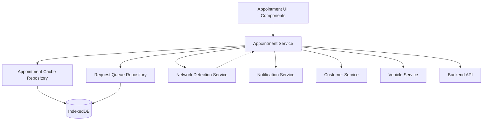

# Design Document: Appointments Management

## Overview

The Appointments Management module provides comprehensive scheduling and tracking capabilities for the Valvoline service center POS PWA application. It implements a network-first caching strategy with IndexedDB fallback for offline support, following the established architectural patterns in the codebase.

The module consists of:
- Appointment scheduling with time slot validation and bay assignment
- Calendar views (daily, weekly, monthly) for schedule visualization
- Appointment search and filtering with multiple criteria
- Status management (scheduled, checked-in, in-progress, completed, cancelled, no-show)
- Service type configuration with duration calculation
- Offline-first data synchronization with conflict resolution
- Notification system for confirmations and reminders
- Reporting and analytics for service center performance
- Integration with Customer Management and Vehicle Search features

The design follows Angular standalone component architecture with strict TypeScript typing, reactive patterns using RxJS, and repository pattern for data persistence.

## Architecture

### High-Level Architecture



### Data Flow Patterns

**Network-First Strategy** (for reads):
1. Attempt API call
2. On success: cache response, return data
3. On failure: check cache, return cached data if available
4. If cache miss: return error with offline message

**Write-Through Strategy** (for writes):
1. Validate data locally (time slot availability, business rules)
2. If online: send to API, update cache on success
3. If offline: save to cache, queue for sync
4. On reconnection: process queue with conflict resolution

**Cache Strategy**:
- Cache appointments for next 7 days on application start
- Update cache on all create/update operations
- Evict appointments older than current date daily
- Preload related customer and vehicle data for cached appointments

### Component Structure

```
features/appointments/
├── components/
│   ├── appointment-calendar/
│   ├── appointment-detail/
│   ├── appointment-form/
│   ├── appointment-search/
│   ├── daily-view/
│   ├── weekly-view/
│   ├── monthly-view/
│   ├── time-slot-picker/
│   ├── service-type-selector/
│   └── appointment-reports/
├── services/
│   └── appointment.service.ts
└── models/ (in core/models/)
    └── appointment.model.ts

core/repositories/
├── appointment-cache.repository.ts
└── indexeddb.repository.ts (existing)
```

## Components and Interfaces

### Appointment Service

The AppointmentService handles all appointment-related API operations with offline support.

```typescript
interface AppointmentService {
  // Create operations
  createAppointment(appointment: Partial<Appointment>): Observable<Appointment | null>
  createWalkIn(customerId: string, vehicleId: string, serviceTypes: string[]): Observable<Appointment | null>
  
  // Read operations
  getAppointmentById(appointmentId: string): Observable<Appointment | null>
  getAppointmentsByDate(date: Date): Observable<Appointment[]>
  getAppointmentsByDateRange(startDate: Date, endDate: Date): Observable<Appointment[]>
  
  // Search and filter operations
  searchAppointments(criteria: AppointmentSearchCriteria): Observable<Appointment[]>
  filterByStatus(status: AppointmentStatus): Observable<Appointment[]>
  filterByTechnician(technicianId: string): Observable<Appointment[]>
  filterByServiceType(serviceType: string): Observable<Appointment[]>
  
  // Update operations
  updateAppointment(appointmentId: string, updates: Partial<Appointment>): Observable<Appointment | null>
  rescheduleAppointment(appointmentId: string, newDateTime: Date): Observable<Appointment | null>
  reassignBay(appointmentId: string, bayNumber: number): Observable<Appointment | null>
  reassignTechnician(appointmentId: string, technicianId: string): Observable<Appointment | null>
  updateServices(appointmentId: string, serviceTypes: string[]): Observable<Appointment | null>
  
  // Status management operations
  checkInAppointment(appointmentId: string): Observable<Appointment | null>
  startService(appointmentId: string): Observable<Appointment | null>
  completeAppointment(appointmentId: string): Observable<Appointment | null>
  cancelAppointment(appointmentId: string, reason: string): Observable<Appointment | null>
  markNoShow(appointmentId: string): Observable<Appointment | null>
  
  // Time slot operations
  getAvailableTimeSlots(date: Date, duration: number): Observable<TimeSlot[]>
  validateTimeSlot(dateTime: Date, duration: number, bayNumber?: number): Observable<boolean>
  
  // Service type operations
  getServiceTypes(): Observable<ServiceType[]>
  calculateDuration(serviceTypeIds: string[]): number
  
  // Reporting operations
  getDailySummary(date: Date): Observable<AppointmentSummary>
  getServiceTypeDistribution(startDate: Date, endDate: Date): Observable<ServiceTypeStats[]>
  getTechnicianUtilization(startDate: Date, endDate: Date): Observable<TechnicianUtilization[]>
  getNoShowRate(startDate: Date, endDate: Date): Observable<NoShowStats>
  getAverageServiceTime(startDate: Date, endDate: Date): Observable<number>
  
  // Notification operations
  sendConfirmation(appointmentId: string): Observable<boolean>
  sendReminder(appointmentId: string): Observable<boolean>
  sendCancellation(appointmentId: string): Observable<boolean>
  sendRescheduleNotification(appointmentId: string): Observable<boolean>
  
  // Cache management
  refreshCache(): Observable<void>
  getCacheStats(): Observable<CacheStats>
}
```

### Appointment Cache Repository

Extends IndexedDBRepository to provide appointment-specific caching with time-based eviction.

```typescript
interface AppointmentCacheRepository {
  // Cache operations
  save(appointment: Appointment): Promise<void>
  getById(appointmentId: string): Promise<Appointment | null>
  getByDate(date: Date): Promise<Appointment[]>
  getByDateRange(startDate: Date, endDate: Date): Promise<Appointment[]>
  update(appointmentId: string, updates: Partial<Appointment>): Promise<void>
  delete(appointmentId: string): Promise<void>
  
  // Search operations
  search(criteria: AppointmentSearchCriteria): Promise<Appointment[]>
  filterByStatus(status: AppointmentStatus): Promise<Appointment[]>
  filterByTechnician(technicianId: string): Promise<Appointment[]>
  filterByServiceType(serviceType: string): Promise<Appointment[]>
  
  // Cache management
  evictOldAppointments(): Promise<void>
  clearCache(): Promise<void>
  getStats(): Promise<CacheStats>
  
  // Preloading
  preloadRelatedData(appointments: Appointment[]): Promise<void>
}
```

### Time Slot Validator

Provides time slot availability validation and conflict detection.

```typescript
interface TimeSlotValidator {
  // Availability checking
  isTimeSlotAvailable(dateTime: Date, duration: number): Promise<boolean>
  getAvailableSlots(date: Date, duration: number): Promise<TimeSlot[]>
  getAvailableBays(dateTime: Date, duration: number): Promise<number[]>
  
  // Validation
  validateAppointmentTime(dateTime: Date): ValidationResult
  validateDuration(duration: number): ValidationResult
  validateBayNumber(bayNumber: number): ValidationResult
  validateWithinStoreHours(dateTime: Date, duration: number): ValidationResult
  validateAdvanceBooking(dateTime: Date): ValidationResult
  
  // Conflict detection
  detectConflicts(dateTime: Date, duration: number, bayNumber: number): Promise<Appointment[]>
  wouldCauseOverbooking(dateTime: Date, duration: number): Promise<boolean>
}
```

### Notification Service

Handles appointment notifications via SMS and email.

```typescript
interface NotificationService {
  // Send notifications
  sendAppointmentConfirmation(appointment: Appointment): Promise<boolean>
  sendAppointmentReminder(appointment: Appointment): Promise<boolean>
  sendCancellationNotice(appointment: Appointment): Promise<boolean>
  sendRescheduleNotice(appointment: Appointment, oldDateTime: Date): Promise<boolean>
  sendTechnicianNotification(technicianId: string, appointment: Appointment): Promise<boolean>
  
  // Notification scheduling
  scheduleReminder(appointment: Appointment): Promise<void>
  cancelScheduledReminder(appointmentId: string): Promise<void>
  
  // Template operations
  getNotificationTemplate(type: NotificationType): NotificationTemplate
  formatNotification(template: NotificationTemplate, appointment: Appointment): string
}
```

### UI Components

**AppointmentCalendarComponent**:
- View switcher (daily, weekly, monthly)
- Date navigation controls
- Quick actions (new appointment, search)
- Refresh and sync status indicators

**DailyViewComponent**:
- Timeline grid showing time slots (8 AM - 6 PM)
- Service bay columns (4 bays)
- Appointment cards with drag-and-drop support
- Color coding by status
- Quick check-in action

**WeeklyViewComponent**:
- 6-day grid (Monday-Saturday)
- Appointment count per day
- Visual indicators for busy days
- Click to view day details

**MonthlyViewComponent**:
- Calendar grid with appointment counts
- Color intensity based on appointment volume
- Click to view day details
- Navigation between months

**AppointmentFormComponent**:
- Customer selection with search
- Vehicle selection (filtered by customer)
- Service type multi-select
- Date and time picker with availability validation
- Service bay selection
- Technician assignment
- Duration calculation display
- Save/cancel actions

**AppointmentDetailComponent**:
- Appointment information display
- Customer and vehicle details
- Service list with durations
- Status timeline
- Action buttons (check-in, start, complete, cancel, reschedule)
- Edit appointment button

**AppointmentSearchComponent**:
- Search input with criteria selector
- Filter chips (status, service type, technician, date range)
- Search results list
- Empty state with create option

**TimeSlotPickerComponent**:
- Date picker
- Available time slots grid
- Unavailable slots grayed out
- Duration indicator
- Bay availability display

**ServiceTypeSelectorComponent**:
- Service category groups
- Multi-select checkboxes
- Duration display per service
- Total duration calculation
- Custom service option

**AppointmentReportsComponent**:
- Report type selector
- Date range picker
- Filter options
- Chart visualizations
- Export to PDF/CSV actions

## Data Models

### Core Models

```typescript
interface Appointment {
  id: string
  customerId: string
  vehicleId: string
  serviceTypes: string[]
  scheduledDateTime: string // ISO 8601
  endDateTime: string // ISO 8601
  duration: number // minutes
  bufferTime: number // minutes (always 15)
  serviceBay: number // 1-4
  technicianId: string
  status: AppointmentStatus
  checkInTime?: string
  startTime?: string
  completionTime?: string
  cancellationTime?: string
  cancellationReason?: string
  notes?: string
  createdBy: string
  createdDate: string
  lastModifiedBy?: string
  lastModifiedDate?: string
  version: number // for optimistic locking
}

type AppointmentStatus = 
  | 'scheduled'
  | 'checked-in'
  | 'in-progress'
  | 'completed'
  | 'cancelled'
  | 'no-show'

interface ServiceType {
  id: string
  name: string
  category: ServiceCategory
  duration: number // minutes
  description: string
  isActive: boolean
}

type ServiceCategory =
  | 'Oil Change'
  | 'Fluid Service'
  | 'Filter Service'
  | 'Battery'
  | 'Wiper'
  | 'Light'
  | 'Tire'
  | 'Inspection'
  | 'Custom'

interface TimeSlot {
  startTime: Date
  endTime: Date
  availableBays: number[]
  isAvailable: boolean
}

interface AppointmentSearchCriteria {
  searchTerm?: string
  customerId?: string
  vehicleId?: string
  status?: AppointmentStatus
  serviceType?: string
  technicianId?: string
  startDate?: Date
  endDate?: Date
}

interface AppointmentSummary {
  date: Date
  totalAppointments: number
  scheduled: number
  checkedIn: number
  inProgress: number
  completed: number
  cancelled: number
  noShow: number
}

interface ServiceTypeStats {
  serviceType: string
  count: number
  percentage: number
}

interface TechnicianUtilization {
  technicianId: string
  technicianName: string
  totalAppointments: number
  totalHours: number
  utilizationPercentage: number
}

interface NoShowStats {
  totalAppointments: number
  noShowCount: number
  noShowPercentage: number
}

interface NotificationTemplate {
  type: NotificationType
  subject: string
  body: string
  variables: string[]
}

type NotificationType =
  | 'confirmation'
  | 'reminder'
  | 'cancellation'
  | 'reschedule'
  | 'technician-assignment'
  | 'check-in'

interface StoreHours {
  dayOfWeek: number // 0-6 (Sunday-Saturday)
  isOpen: boolean
  openTime: string // HH:mm format
  closeTime: string // HH:mm format
}

interface BusinessRules {
  maxServiceBays: number
  bufferTimeMinutes: number
  advanceBookingDays: number
  checkInWindowMinutes: number
  noShowThresholdMinutes: number
  storeHours: StoreHours[]
}
```

### Cache Models

```typescript
interface CachedAppointment extends Appointment {
  cachedAt: Date
  syncStatus: 'synced' | 'pending' | 'conflict'
  customerData?: CustomerSummary // preloaded
  vehicleData?: VehicleSummary // preloaded
}

interface QueuedAppointmentOperation {
  id: string
  operation: 'create' | 'update' | 'delete' | 'status-change'
  appointmentId?: string
  data?: Partial<Appointment>
  timestamp: Date
  retryCount: number
  maxRetries: number
}

interface ConflictResolution {
  appointmentId: string
  localVersion: number
  serverVersion: number
  localData: Partial<Appointment>
  serverData: Appointment
  resolution: 'server-wins' | 'local-wins' | 'manual'
  resolvedAt: Date
}
```

### Integration Models

```typescript
interface CustomerSummary {
  id: string
  name: string
  phone: string
  email: string
  preferredContactMethod: 'email' | 'phone' | 'sms'
}

interface VehicleSummary {
  id: string
  year: number
  make: string
  model: string
  vin: string
  licensePlate?: string
}

interface ServiceHistoryRecord {
  appointmentId: string
  customerId: string
  vehicleId: string
  serviceDate: string
  services: string[]
  technicianId: string
  duration: number
  notes?: string
}
```

## Correctness Properties

*A property is a characteristic or behavior that should hold true across all valid executions of a system—essentially, a formal statement about what the system should do. Properties serve as the bridge between human-readable specifications and machine-verifiable correctness guarantees.*


### Property 1: Appointment Creation Assigns Unique ID

*For any* valid appointment data (customer, vehicle, service type, date/time, bay, technician), creating an appointment should assign a unique identifier that differs from all existing appointment IDs.

**Validates: Requirements 1.1**

### Property 2: Required Field Validation

*For any* appointment data missing required fields (customer, vehicle, service type, or date/time), creation should be rejected with validation errors identifying the missing fields.

**Validates: Requirements 1.2**

### Property 3: End Time Calculation

*For any* appointment with selected service types, the end time should equal the scheduled start time plus the sum of all service durations.

**Validates: Requirements 1.3, 6.3**

### Property 4: Buffer Time Constant

*For any* created appointment, the buffer time should be set to exactly 15 minutes.

**Validates: Requirements 1.4**

### Property 5: Overbooking Prevention

*For any* time slot where 4 concurrent appointments already exist, attempting to create another appointment for that time slot should be rejected with an availability error.

**Validates: Requirements 1.5, 7.2**

### Property 6: Initial Status Assignment

*For any* newly created appointment, the initial status should be set to "scheduled".

**Validates: Requirements 1.6**

### Property 7: Walk-In Current Time

*For any* walk-in appointment, the scheduled date/time should be within 1 minute of the current time.

**Validates: Requirements 1.7**

### Property 8: Advance Booking Window Validation

*For any* appointment with a scheduled date more than 30 days in the future, creation should be rejected.

**Validates: Requirements 1.8**

### Property 9: Store Hours Validation

*For any* appointment with a scheduled time before 8 AM, after 6 PM, or on Sunday, creation should be rejected.

**Validates: Requirements 1.9, 7.6**

### Property 10: Store Hours End Time Validation

*For any* appointment, the end time plus buffer time should fall within store hours (before 6 PM and not on Sunday).

**Validates: Requirements 7.7**

### Property 11: Online Operations Persist Immediately

*For any* create, update, or status change operation performed while online, the operation should result in an immediate API call to the backend.

**Validates: Requirements 1.10, 4.7, 5.8**

### Property 12: Offline Operations Queued

*For any* create, update, or status change operation performed while offline, the operation should be added to the sync queue and stored in local cache.

**Validates: Requirements 1.11, 4.8, 5.9, 8.2**

### Property 13: Date Query Returns Sorted Results

*For any* date and set of appointments, querying appointments for that date should return all appointments on that date sorted by start time in ascending order.

**Validates: Requirements 2.1**

### Property 14: Date Range Query Returns Sorted Results

*For any* date range and set of appointments, querying appointments for that range should return all appointments within the range sorted first by start time, then by service bay number.

**Validates: Requirements 2.2**

### Property 15: Daily View Display Completeness

*For any* daily view rendering, the output should contain time slots, service bay assignments, and all appointment details for each appointment.

**Validates: Requirements 2.3**

### Property 16: Weekly View Grouping Accuracy

*For any* weekly view rendering, appointments should be correctly grouped by day and the count for each day should match the actual number of appointments.

**Validates: Requirements 2.4**

### Property 17: Monthly View Count Accuracy

*For any* monthly view rendering, the appointment count for each day should match the actual number of appointments on that day.

**Validates: Requirements 2.5**

### Property 18: Online Fetch from Backend

*For any* read operation performed while online, the system should attempt to fetch data from the backend API before falling back to cache.

**Validates: Requirements 2.6**

### Property 19: Offline Fetch from Cache

*For any* read operation performed while offline, the system should retrieve data exclusively from the local cache without attempting API calls.

**Validates: Requirements 2.7**

### Property 20: Appointment Display Completeness

*For any* appointment displayed in any view, the rendering should include customer name, vehicle information, service type, time, status, and assigned technician.

**Validates: Requirements 2.8**

### Property 21: Search Returns Matching Results

*For any* search criteria (customer name, vehicle VIN/plate, status, service type, technician, date range) and set of appointments, all returned results should match the specified criteria, and if multiple criteria are provided, results should match ALL criteria.

**Validates: Requirements 3.1, 3.2, 3.3, 3.4, 3.5, 3.6, 3.7**

### Property 22: Update Applies Changes and Timestamp

*For any* appointment and valid update data, applying the update should modify the specified fields and update the lastModifiedDate to the current timestamp.

**Validates: Requirements 4.1**

### Property 23: Reschedule Validates Availability

*For any* appointment reschedule request, the system should validate time slot availability at the new date/time before applying the change, and reject if unavailable.

**Validates: Requirements 4.2**

### Property 24: Bay Reassignment Validates Availability

*For any* bay reassignment request, the system should validate that the new bay is available for the appointment's time slot before applying the change.

**Validates: Requirements 4.3**

### Property 25: Technician Reassignment Updates Assignment

*For any* appointment and new technician ID, reassigning the technician should update the technicianId field to the new value.

**Validates: Requirements 4.4**

### Property 26: Service Modification Recalculates Duration

*For any* appointment with service modifications (additions or removals), the system should recalculate the total duration as the sum of all service durations and update the end time accordingly.

**Validates: Requirements 4.5**

### Property 27: Update Overbooking Prevention

*For any* appointment update that would cause the time slot to exceed 4 concurrent appointments, the update should be rejected and the appointment should remain unchanged.

**Validates: Requirements 4.6**

### Property 28: Completed/Cancelled Appointment Immutability

*For any* appointment with status "completed" or "cancelled", attempting to update the appointment should be rejected.

**Validates: Requirements 4.9**

### Property 29: Check-In Updates Status and Timestamp

*For any* appointment with status "scheduled", checking in should update the status to "checked-in" and set the checkInTime to the current timestamp.

**Validates: Requirements 5.1**

### Property 30: Start Service Updates Status and Timestamp

*For any* appointment with status "checked-in", starting service should update the status to "in-progress" and set the startTime to the current timestamp.

**Validates: Requirements 5.2**

### Property 31: Complete Updates Status and Timestamp

*For any* appointment with status "in-progress", completing the appointment should update the status to "completed" and set the completionTime to the current timestamp.

**Validates: Requirements 5.3**

### Property 32: Cancel Updates Status, Timestamp, and Reason

*For any* appointment and cancellation reason, cancelling should update the status to "cancelled", set the cancellationTime to the current timestamp, and store the cancellation reason.

**Validates: Requirements 5.4, 12.7**

### Property 33: Complete Requires In-Progress Status

*For any* appointment with status other than "in-progress", attempting to complete the appointment should be rejected.

**Validates: Requirements 5.7**

### Property 34: Service Type Data Completeness

*For any* service type retrieved from the system, it should contain a name, duration (positive integer), and description.

**Validates: Requirements 6.2**

### Property 35: Custom Service Type Support

*For any* custom service with user-defined name and duration, the system should allow creating the service type and using it in appointments.

**Validates: Requirements 6.5**

### Property 36: Concurrent Appointment Counting

*For any* time period and set of appointments, calculating concurrent appointments should return the count of appointments whose time ranges (including buffer) overlap with the specified period.

**Validates: Requirements 7.1**

### Property 37: Available Slots Within Hours and Capacity

*For any* date and duration, all returned available time slots should fall within store hours and have at least one service bay available.

**Validates: Requirements 7.3**

### Property 38: Buffer Time Included in Availability

*For any* appointment, when checking time slot conflicts or bay availability, the system should consider the appointment to occupy its duration plus 15-minute buffer time.

**Validates: Requirements 7.4, 7.5**

### Property 39: Cache Initialization Scope

*For any* application start, after cache initialization completes, all cached appointments should have scheduled dates within the next 7 days from the current date.

**Validates: Requirements 8.1, 14.4**

### Property 40: Sync Queue Chronological Processing

*For any* set of queued operations with timestamps, processing the sync queue should execute operations in chronological order (oldest timestamp first).

**Validates: Requirements 8.3**

### Property 41: Conflict Detection During Sync

*For any* queued operation where the server version number differs from the local version number, the system should detect and flag a conflict.

**Validates: Requirements 8.4, 13.2**

### Property 42: Last-Write-Wins Conflict Resolution

*For any* detected conflict, the system should apply the modification with the most recent timestamp and notify the user of the conflict.

**Validates: Requirements 8.5, 13.3, 13.4**

### Property 43: Cache Refresh After Sync

*For any* sync operation, after processing completes, the local cache should contain the latest server data for all appointments in the cache scope.

**Validates: Requirements 8.6**

### Property 44: Offline Availability Uses Cache Only

*For any* availability check performed while offline, the system should use only cached appointment data without attempting API calls.

**Validates: Requirements 8.7**

### Property 45: Sync-Time Availability Validation

*For any* appointment created offline, when syncing to the server, the system should re-validate time slot availability against current server state and reject if no longer available.

**Validates: Requirements 8.8**

### Property 46: Confirmation Notification on Creation

*For any* created appointment, the system should send a confirmation notification to the customer using their preferred contact method (SMS or email).

**Validates: Requirements 9.1**

### Property 47: Cancellation Notification on Cancel

*For any* appointment status change to "cancelled", the system should send a cancellation notification to the customer.

**Validates: Requirements 9.3**

### Property 48: Reschedule Notification on Reschedule

*For any* appointment reschedule operation, the system should send a notification to the customer containing the updated date and time.

**Validates: Requirements 9.4**

### Property 49: Technician Assignment Notification

*For any* appointment with technician assignment, the system should send a notification to the assigned technician.

**Validates: Requirements 9.5**

### Property 50: Check-In Technician Notification

*For any* appointment check-in, the system should send a notification to the assigned technician.

**Validates: Requirements 9.6**

### Property 51: Notification Content Completeness

*For any* notification sent, the message should include customer name, vehicle information, service type, date/time, and service bay.

**Validates: Requirements 9.7**

### Property 52: Daily Summary Calculation Accuracy

*For any* date and set of appointments, the daily summary should contain accurate counts for each status (scheduled, checked-in, in-progress, completed, cancelled, no-show) matching the actual appointment statuses.

**Validates: Requirements 10.1**

### Property 53: Service Type Distribution Calculation

*For any* date range and set of appointments, the service type distribution should contain accurate counts and percentages for each service type, with percentages summing to 100%.

**Validates: Requirements 10.2**

### Property 54: Technician Utilization Calculation

*For any* date range and set of appointments, technician utilization should be calculated as (total appointment hours / total available hours) * 100 for each technician.

**Validates: Requirements 10.3**

### Property 55: No-Show Rate Calculation

*For any* date range and set of appointments, the no-show rate should be calculated as (no-show count / total appointments) * 100.

**Validates: Requirements 10.4**

### Property 56: Average Service Time Calculation

*For any* set of completed appointments with start and completion timestamps, the average service time should be the mean of (completionTime - startTime) across all appointments.

**Validates: Requirements 10.5**

### Property 57: Report Filtering Accuracy

*For any* report request with filters (date range, technician, service type), the report data should include only appointments matching all specified filters.

**Validates: Requirements 10.6**

### Property 58: Customer ID Validation

*For any* appointment creation with a customer ID that does not exist in the Customer Management system, the creation should be rejected with a validation error.

**Validates: Requirements 11.1**

### Property 59: Vehicle Ownership Validation

*For any* appointment creation with a vehicle ID that does not belong to the specified customer, the creation should be rejected with a validation error.

**Validates: Requirements 11.2**

### Property 60: Appointment Detail Customer Data Completeness

*For any* appointment detail view, the displayed customer information should include name, phone, and email.

**Validates: Requirements 11.3**

### Property 61: Appointment Detail Vehicle Data Completeness

*For any* appointment detail view, the displayed vehicle information should include year, make, model, VIN, and license plate.

**Validates: Requirements 11.4**

### Property 62: Completion Creates Service History

*For any* appointment that is completed, the system should create a service history record linked to the vehicle containing the appointment details.

**Validates: Requirements 11.5**

### Property 63: Technician ID Validation

*For any* appointment creation with a technician ID that does not exist in the Employee system, the creation should be rejected with a validation error.

**Validates: Requirements 11.6**

### Property 64: Vehicle Selection Filtered by Customer

*For any* customer selected in the appointment form, the available vehicles for selection should include only vehicles belonging to that customer.

**Validates: Requirements 11.7**

### Property 65: Start Time Before End Time Invariant

*For any* appointment, the scheduled start time should be strictly before the calculated end time.

**Validates: Requirements 12.1**

### Property 66: No Past Appointments (Except Walk-Ins)

*For any* scheduled appointment (non-walk-in), the scheduled date/time should not be in the past relative to the creation time.

**Validates: Requirements 12.2**

### Property 67: Service Bay Number Validation

*For any* appointment, the service bay number should be an integer between 1 and 4 (inclusive).

**Validates: Requirements 12.3**

### Property 68: Positive Duration Validation

*For any* appointment, the duration should be a positive non-zero integer.

**Validates: Requirements 12.4**

### Property 69: ISO 8601 Timestamp Format

*For any* appointment timestamp field (scheduledDateTime, endDateTime, checkInTime, startTime, completionTime, cancellationTime), the value should be a valid ISO 8601 formatted string with timezone information.

**Validates: Requirements 12.8**

### Property 70: Version Number Increment on Update

*For any* appointment update, the version number should be incremented by exactly 1.

**Validates: Requirements 13.6**

### Property 71: Conflict Notification on Resolution

*For any* conflict detected and resolved during sync, the system should display a notification to the user describing the conflict and resolution.

**Validates: Requirements 13.4**

### Property 72: Update Deleted Appointment Rejection

*For any* appointment that has been deleted on the server, attempting to update it should be rejected and the user should be notified.

**Validates: Requirements 13.5**

### Property 73: Cache Update on Create/Update

*For any* appointment create or update operation, the local cache should be updated immediately to reflect the new or modified appointment data.

**Validates: Requirements 14.5**

### Property 74: Old Appointment Eviction

*For any* cached appointment with a scheduled date before the current date, the appointment should be removed from the cache during eviction.

**Validates: Requirements 14.6**

### Property 75: Preloaded Related Data

*For any* cached appointment, the cache entry should include preloaded customer data (name, phone, email) and vehicle data (year, make, model, VIN).

**Validates: Requirements 14.7**

### Property 76: Technician and Manager Create Permission

*For any* user with role "Technician" or "Manager", creating an appointment should be allowed.

**Validates: Requirements 15.1**

### Property 77: Technician and Manager Update Permission

*For any* user with role "Technician" or "Manager", updating an appointment should be allowed.

**Validates: Requirements 15.2**

### Property 78: Technician and Manager Check-In Permission

*For any* user with role "Technician" or "Manager", checking in an appointment should be allowed.

**Validates: Requirements 15.3**

### Property 79: Manager-Only Cancellation Permission

*For any* user with role "Technician", attempting to cancel an appointment should be rejected with an authorization error. For any user with role "Manager", cancellation should be allowed.

**Validates: Requirements 15.4**

### Property 80: Manager-Only Reporting Permission

*For any* user with role "Technician", attempting to access reporting features should be rejected with an authorization error. For any user with role "Manager", reporting access should be allowed.

**Validates: Requirements 15.5**

### Property 81: Unauthorized Operation Rejection

*For any* operation attempted by a user without the required permission, the operation should be rejected and return an authorization error.

**Validates: Requirements 15.6**

### Property 82: Authentication Token Validation

*For any* appointment operation, the system should validate the user's authentication token before processing, and reject operations with invalid or missing tokens.

**Validates: Requirements 15.7**

### Property 83: Audit Logging for All Operations

*For any* appointment operation (create, update, status change, delete), the system should create an audit log entry containing the user ID, operation type, appointment ID, and timestamp.

**Validates: Requirements 15.8**

### Property 84: IndexedDB Serialization Round-Trip

*For any* valid Appointment object, serializing to JSON, storing in IndexedDB, retrieving, and deserializing should produce an equivalent Appointment object with all fields intact.

**Validates: Requirements 8.1, 14.5**

### Property 85: API Serialization Round-Trip

*For any* valid Appointment object, serializing to JSON, sending to the backend API, receiving the response, and deserializing should produce an equivalent Appointment object.

**Validates: Requirements 1.10, 4.7**

## Error Handling

### Error Categories

The system implements structured error handling with the following categories:

1. **Validation Errors**: Invalid input data (missing required fields, invalid dates, invalid bay numbers)
2. **Availability Errors**: Time slot unavailable, overbooking, bay conflicts
3. **Business Rule Errors**: Outside store hours, beyond advance booking window, past dates
4. **Authorization Errors**: Insufficient permissions for operation
5. **Referential Integrity Errors**: Invalid customer ID, vehicle ID, or technician ID
6. **State Transition Errors**: Invalid status changes (e.g., complete non-in-progress appointment)
7. **Network Errors**: API communication failures, timeout errors
8. **Conflict Errors**: Concurrent modification conflicts, version mismatches
9. **Storage Errors**: IndexedDB operation failures

### Error Handling Strategy

**Validation Errors**:
- Display inline field-level errors in forms
- Prevent form submission until resolved
- Highlight invalid fields with red borders
- Provide specific error messages (e.g., "Customer is required")

**Availability Errors**:
- Display modal dialog with availability message
- Suggest alternative time slots
- Show calendar with available slots highlighted
- Allow user to select different time

**Business Rule Errors**:
- Display clear explanation of violated rule
- Show store hours or booking window limits
- Prevent invalid selections in UI (disable out-of-hours times)
- Provide guidance for valid options

**Authorization Errors**:
- Display access denied message
- Explain required permission level (e.g., "Manager permission required")
- Hide unauthorized actions in UI
- Log unauthorized attempts for security audit

**Referential Integrity Errors**:
- Display "not found" message for invalid references
- Offer to search for valid customer/vehicle/technician
- Prevent invalid selections through dropdowns
- Validate references before submission

**State Transition Errors**:
- Display current status and allowed transitions
- Disable invalid action buttons
- Explain why action is not allowed
- Show appointment status timeline

**Network Errors**:
- Display offline indicator
- Queue operations automatically
- Show "queued for sync" confirmation
- Provide manual retry option
- Fall back to cached data for reads

**Conflict Errors**:
- Display conflict resolution dialog
- Show both local and server versions
- Explain resolution applied (server wins)
- Allow user to review changes
- Log conflict details

**Storage Errors**:
- Attempt operation retry with exponential backoff
- Display storage error message
- Suggest clearing old data
- Log error for support

### Error Recovery

The system implements automatic error recovery:

1. **Exponential Backoff**: Failed API calls retry with increasing delays (1s, 2s, 4s, 8s, 16s)
2. **Queue Persistence**: Failed operations persist in IndexedDB across app restarts
3. **Automatic Sync**: Queue processing triggers automatically on network restoration
4. **Conflict Resolution**: Server data is authoritative (last-write-wins by timestamp)
5. **Graceful Degradation**: System remains functional with cached data during network issues
6. **Optimistic Locking**: Version numbers prevent lost updates from concurrent modifications

## Testing Strategy

### Dual Testing Approach

The Appointments Management module requires both unit testing and property-based testing for comprehensive coverage:

**Unit Tests**: Verify specific examples, edge cases, and error conditions
- Empty appointment list display
- No available time slots display
- Specific time slot conflict scenarios
- Early check-in rejection (>30 minutes before)
- No-show automatic marking (15 minutes after start)
- Specific validation error messages
- Component rendering with specific data
- Integration between components
- Notification template formatting

**Property Tests**: Verify universal properties across all inputs
- All 85 correctness properties listed above
- Minimum 100 iterations per property test
- Random data generation for appointments, customers, vehicles, service types
- Each test tagged with: **Feature: appointments-management, Property N: [property text]**

### Property-Based Testing Library

**Library**: fast-check (TypeScript/JavaScript property-based testing library)

**Configuration**:
```typescript
import * as fc from 'fast-check'

// Example property test configuration
fc.assert(
  fc.property(
    fc.record({
      customerId: fc.uuid(),
      vehicleId: fc.uuid(),
      serviceTypes: fc.array(fc.uuid(), { minLength: 1, maxLength: 5 }),
      scheduledDateTime: fc.date({ min: new Date(), max: new Date(Date.now() + 30 * 24 * 60 * 60 * 1000) }),
      serviceBay: fc.integer({ min: 1, max: 4 }),
      technicianId: fc.uuid()
    }),
    (appointmentData) => {
      // Test property
    }
  ),
  { numRuns: 100 }
)
```

### Custom Generators for Property Tests

```typescript
// Generate valid appointment within business rules
const validAppointmentGen = fc.record({
  customerId: fc.uuid(),
  vehicleId: fc.uuid(),
  serviceTypes: fc.array(fc.constantFrom('oil-change', 'tire-rotation', 'inspection'), { minLength: 1, maxLength: 3 }),
  scheduledDateTime: fc.date()
    .filter(d => {
      const day = d.getDay()
      const hour = d.getHours()
      return day !== 0 && hour >= 8 && hour < 18 // Not Sunday, within 8 AM - 6 PM
    }),
  serviceBay: fc.integer({ min: 1, max: 4 }),
  technicianId: fc.constantFrom('TECH001', 'TECH002', 'TECH003')
})

// Generate time within store hours
const storeHoursTimeGen = fc.date().filter(d => {
  const day = d.getDay()
  const hour = d.getHours()
  return day >= 1 && day <= 6 && hour >= 8 && hour < 18
})

// Generate time outside store hours
const outsideStoreHoursGen = fc.date().filter(d => {
  const day = d.getDay()
  const hour = d.getHours()
  return day === 0 || hour < 8 || hour >= 18
})
```

### Test Organization

```
features/appointments/
├── services/
│   └── appointment.service.spec.ts (unit tests)
│   └── appointment.service.property.spec.ts (property tests)
├── components/
│   ├── appointment-calendar/
│   │   └── appointment-calendar.component.spec.ts (unit tests)
│   ├── appointment-form/
│   │   └── appointment-form.component.spec.ts (unit tests)
│   │   └── appointment-form.property.spec.ts (property tests)
│   ├── appointment-detail/
│   │   └── appointment-detail.component.spec.ts (unit tests)
│   └── daily-view/
│       └── daily-view.component.spec.ts (unit tests)
└── repositories/
    └── appointment-cache.repository.spec.ts (unit tests)
    └── appointment-cache.repository.property.spec.ts (property tests)
└── validators/
    └── time-slot-validator.spec.ts (unit tests)
    └── time-slot-validator.property.spec.ts (property tests)
```

### Testing Priorities

**High Priority** (implement first):
- Property 5: Overbooking Prevention
- Property 23: Reschedule Validates Availability
- Property 27: Update Overbooking Prevention
- Property 38: Buffer Time Included in Availability
- Property 40: Sync Queue Chronological Processing
- Property 42: Last-Write-Wins Conflict Resolution
- Property 84: IndexedDB Serialization Round-Trip
- Property 85: API Serialization Round-Trip

**Medium Priority**:
- All search and filter properties (21)
- All status management properties (29-33)
- All validation properties (2, 8-10, 58-59, 63, 65-69)
- All calculation properties (3, 26, 36, 52-56)
- All notification properties (46-51)

**Lower Priority**:
- Display completeness properties (15-17, 20, 60-61)
- Permission properties (76-80)
- Cache management properties (39, 43-44, 73-75)

### Integration Testing

Integration tests should verify:
- Appointment creation → customer lookup → vehicle selection → time slot validation → save flow
- Appointment search → detail view → check-in → start service → complete flow
- Offline appointment creation → queue → sync → conflict resolution flow
- Calendar view → appointment selection → reschedule → availability check flow
- Report generation → filtering → data aggregation → chart rendering flow

### Manual Testing Checklist

The following aspects require manual testing:
- Calendar view visual layout and responsiveness
- Drag-and-drop appointment rescheduling
- Touch interaction on mobile devices
- Loading state animations
- Error message clarity and helpfulness
- Notification message formatting
- Report chart visualizations
- Print output formatting
- Overall user experience and workflow efficiency

## Implementation Details

### Time Slot Calculation Algorithm

```typescript
function getAvailableTimeSlots(date: Date, duration: number): TimeSlot[] {
  const slots: TimeSlot[] = []
  const storeOpen = 8 // 8 AM
  const storeClose = 18 // 6 PM
  const slotInterval = 30 // 30-minute intervals
  
  // Generate all possible slots for the day
  for (let hour = storeOpen; hour < storeClose; hour++) {
    for (let minute = 0; minute < 60; minute += slotInterval) {
      const startTime = new Date(date)
      startTime.setHours(hour, minute, 0, 0)
      
      const endTime = new Date(startTime.getTime() + duration * 60000)
      const endWithBuffer = new Date(endTime.getTime() + 15 * 60000)
      
      // Check if end time + buffer falls within store hours
      if (endWithBuffer.getHours() >= storeClose) {
        continue
      }
      
      // Check bay availability
      const availableBays = getAvailableBays(startTime, duration)
      
      slots.push({
        startTime,
        endTime,
        availableBays,
        isAvailable: availableBays.length > 0
      })
    }
  }
  
  return slots
}

function getAvailableBays(startTime: Date, duration: number): number[] {
  const endTime = new Date(startTime.getTime() + (duration + 15) * 60000)
  const allBays = [1, 2, 3, 4]
  
  // Get all appointments that overlap with this time range
  const overlapping = appointments.filter(apt => {
    const aptStart = new Date(apt.scheduledDateTime)
    const aptEnd = new Date(apt.endDateTime)
    const aptEndWithBuffer = new Date(aptEnd.getTime() + 15 * 60000)
    
    return (aptStart < endTime && aptEndWithBuffer > startTime)
  })
  
  // Remove occupied bays
  const occupiedBays = overlapping.map(apt => apt.serviceBay)
  return allBays.filter(bay => !occupiedBays.includes(bay))
}
```

### Conflict Resolution Algorithm

```typescript
function resolveConflict(
  localOperation: QueuedAppointmentOperation,
  serverAppointment: Appointment
): ConflictResolution {
  // Compare timestamps
  const localTimestamp = new Date(localOperation.timestamp)
  const serverTimestamp = new Date(serverAppointment.lastModifiedDate || serverAppointment.createdDate)
  
  // Last-write-wins: most recent timestamp wins
  const resolution: ConflictResolution = {
    appointmentId: serverAppointment.id,
    localVersion: localOperation.data?.version || 0,
    serverVersion: serverAppointment.version,
    localData: localOperation.data || {},
    serverData: serverAppointment,
    resolution: localTimestamp > serverTimestamp ? 'local-wins' : 'server-wins',
    resolvedAt: new Date()
  }
  
  return resolution
}
```

### Cache Eviction Strategy

```typescript
async function evictOldAppointments(): Promise<void> {
  const now = new Date()
  const allAppointments = await getAllCachedAppointments()
  
  for (const appointment of allAppointments) {
    const scheduledDate = new Date(appointment.scheduledDateTime)
    
    // Remove appointments older than current date
    if (scheduledDate < now) {
      await deleteCachedAppointment(appointment.id)
    }
  }
}

async function refreshCache(): Promise<void> {
  const now = new Date()
  const sevenDaysLater = new Date(now.getTime() + 7 * 24 * 60 * 60 * 1000)
  
  // Fetch appointments for next 7 days
  const appointments = await fetchAppointmentsByDateRange(now, sevenDaysLater)
  
  // Clear old cache
  await clearAppointmentCache()
  
  // Cache new appointments with preloaded data
  for (const appointment of appointments) {
    const customerData = await fetchCustomerSummary(appointment.customerId)
    const vehicleData = await fetchVehicleSummary(appointment.vehicleId)
    
    await cacheAppointment({
      ...appointment,
      cachedAt: new Date(),
      syncStatus: 'synced',
      customerData,
      vehicleData
    })
  }
}
```

### Notification Scheduling

```typescript
function scheduleReminder(appointment: Appointment): void {
  const scheduledTime = new Date(appointment.scheduledDateTime)
  const reminderTime = new Date(scheduledTime.getTime() - 24 * 60 * 60 * 1000) // 24 hours before
  
  const delay = reminderTime.getTime() - Date.now()
  
  if (delay > 0) {
    setTimeout(() => {
      sendAppointmentReminder(appointment)
    }, delay)
  }
}

function formatNotification(template: NotificationTemplate, appointment: Appointment): string {
  let message = template.body
  
  // Replace variables
  message = message.replace('{{customerName}}', appointment.customerData?.name || '')
  message = message.replace('{{vehicleInfo}}', `${appointment.vehicleData?.year} ${appointment.vehicleData?.make} ${appointment.vehicleData?.model}`)
  message = message.replace('{{serviceTypes}}', appointment.serviceTypes.join(', '))
  message = message.replace('{{dateTime}}', formatDateTime(appointment.scheduledDateTime))
  message = message.replace('{{serviceBay}}', `Bay ${appointment.serviceBay}`)
  
  return message
}
```

### Status Transition State Machine

```typescript
const VALID_TRANSITIONS: Record<AppointmentStatus, AppointmentStatus[]> = {
  'scheduled': ['checked-in', 'cancelled', 'no-show'],
  'checked-in': ['in-progress', 'cancelled', 'no-show'],
  'in-progress': ['completed', 'cancelled'],
  'completed': [], // Terminal state
  'cancelled': [], // Terminal state
  'no-show': [] // Terminal state
}

function isValidTransition(currentStatus: AppointmentStatus, newStatus: AppointmentStatus): boolean {
  return VALID_TRANSITIONS[currentStatus].includes(newStatus)
}
```

## API Contracts

### Appointment Endpoints

```
POST /api/appointments
Request Body: {
  customerId: string
  vehicleId: string
  serviceTypes: string[]
  scheduledDateTime: string (ISO 8601)
  serviceBay: number
  technicianId: string
  notes?: string
}
Response: Appointment (201 Created)
Errors: 400 (validation), 409 (conflict), 401 (unauthorized)

GET /api/appointments/{id}
Response: Appointment (200 OK)
Errors: 404 (not found), 401 (unauthorized)

GET /api/appointments?date={date}
Response: Appointment[] (200 OK)
Errors: 400 (invalid date), 401 (unauthorized)

GET /api/appointments?startDate={start}&endDate={end}
Response: Appointment[] (200 OK)
Errors: 400 (invalid dates), 401 (unauthorized)

PUT /api/appointments/{id}
Request Body: Partial<Appointment> with version number
Response: Appointment (200 OK)
Errors: 400 (validation), 404 (not found), 409 (version conflict), 401 (unauthorized)

DELETE /api/appointments/{id}
Response: 204 No Content
Errors: 404 (not found), 401 (unauthorized), 403 (forbidden)

POST /api/appointments/{id}/check-in
Response: Appointment (200 OK)
Errors: 400 (invalid state), 404 (not found), 401 (unauthorized)

POST /api/appointments/{id}/start
Response: Appointment (200 OK)
Errors: 400 (invalid state), 404 (not found), 401 (unauthorized)

POST /api/appointments/{id}/complete
Response: Appointment (200 OK)
Errors: 400 (invalid state), 404 (not found), 401 (unauthorized)

POST /api/appointments/{id}/cancel
Request Body: { reason: string }
Response: Appointment (200 OK)
Errors: 400 (missing reason), 404 (not found), 401 (unauthorized), 403 (forbidden - not manager)

GET /api/appointments/available-slots?date={date}&duration={minutes}
Response: TimeSlot[] (200 OK)
Errors: 400 (invalid parameters), 401 (unauthorized)

GET /api/service-types
Response: ServiceType[] (200 OK)
Errors: 401 (unauthorized)

GET /api/appointments/reports/daily-summary?date={date}
Response: AppointmentSummary (200 OK)
Errors: 400 (invalid date), 401 (unauthorized), 403 (forbidden - not manager)

GET /api/appointments/reports/service-distribution?startDate={start}&endDate={end}
Response: ServiceTypeStats[] (200 OK)
Errors: 400 (invalid dates), 401 (unauthorized), 403 (forbidden - not manager)

GET /api/appointments/reports/technician-utilization?startDate={start}&endDate={end}
Response: TechnicianUtilization[] (200 OK)
Errors: 400 (invalid dates), 401 (unauthorized), 403 (forbidden - not manager)

GET /api/appointments/reports/no-show-rate?startDate={start}&endDate={end}
Response: NoShowStats (200 OK)
Errors: 400 (invalid dates), 401 (unauthorized), 403 (forbidden - not manager)

POST /api/appointments/{id}/notifications/confirmation
Response: 200 OK
Errors: 404 (not found), 401 (unauthorized), 500 (notification service error)

POST /api/appointments/{id}/notifications/reminder
Response: 200 OK
Errors: 404 (not found), 401 (unauthorized), 500 (notification service error)
```

### Database Schema (Oracle)

```sql
-- Appointments table
CREATE TABLE appointments (
  id VARCHAR2(36) PRIMARY KEY,
  customer_id VARCHAR2(36) NOT NULL,
  vehicle_id VARCHAR2(36) NOT NULL,
  scheduled_date_time TIMESTAMP WITH TIME ZONE NOT NULL,
  end_date_time TIMESTAMP WITH TIME ZONE NOT NULL,
  duration NUMBER(5) NOT NULL,
  buffer_time NUMBER(3) DEFAULT 15,
  service_bay NUMBER(1) NOT NULL CHECK (service_bay BETWEEN 1 AND 4),
  technician_id VARCHAR2(36) NOT NULL,
  status VARCHAR2(20) NOT NULL CHECK (status IN ('scheduled', 'checked-in', 'in-progress', 'completed', 'cancelled', 'no-show')),
  check_in_time TIMESTAMP WITH TIME ZONE,
  start_time TIMESTAMP WITH TIME ZONE,
  completion_time TIMESTAMP WITH TIME ZONE,
  cancellation_time TIMESTAMP WITH TIME ZONE,
  cancellation_reason VARCHAR2(500),
  notes VARCHAR2(1000),
  created_by VARCHAR2(36) NOT NULL,
  created_date TIMESTAMP WITH TIME ZONE DEFAULT CURRENT_TIMESTAMP,
  last_modified_by VARCHAR2(36),
  last_modified_date TIMESTAMP WITH TIME ZONE,
  version NUMBER(10) DEFAULT 1,
  CONSTRAINT fk_customer FOREIGN KEY (customer_id) REFERENCES customers(id),
  CONSTRAINT fk_vehicle FOREIGN KEY (vehicle_id) REFERENCES vehicles(id),
  CONSTRAINT fk_technician FOREIGN KEY (technician_id) REFERENCES employees(id),
  CONSTRAINT chk_start_before_end CHECK (scheduled_date_time < end_date_time)
);

-- Appointment services junction table
CREATE TABLE appointment_services (
  appointment_id VARCHAR2(36) NOT NULL,
  service_type_id VARCHAR2(36) NOT NULL,
  sequence_order NUMBER(3) NOT NULL,
  PRIMARY KEY (appointment_id, service_type_id),
  CONSTRAINT fk_appointment FOREIGN KEY (appointment_id) REFERENCES appointments(id) ON DELETE CASCADE,
  CONSTRAINT fk_service_type FOREIGN KEY (service_type_id) REFERENCES service_types(id)
);

-- Service types table
CREATE TABLE service_types (
  id VARCHAR2(36) PRIMARY KEY,
  name VARCHAR2(100) NOT NULL,
  category VARCHAR2(50) NOT NULL,
  duration NUMBER(5) NOT NULL,
  description VARCHAR2(500),
  is_active NUMBER(1) DEFAULT 1,
  is_custom NUMBER(1) DEFAULT 0,
  created_date TIMESTAMP WITH TIME ZONE DEFAULT CURRENT_TIMESTAMP
);

-- Indexes for performance
CREATE INDEX idx_apt_scheduled_date ON appointments(scheduled_date_time);
CREATE INDEX idx_apt_customer ON appointments(customer_id);
CREATE INDEX idx_apt_vehicle ON appointments(vehicle_id);
CREATE INDEX idx_apt_technician ON appointments(technician_id);
CREATE INDEX idx_apt_status ON appointments(status);
CREATE INDEX idx_apt_bay_date ON appointments(service_bay, scheduled_date_time);
```

## Security Considerations

### Authentication and Authorization

1. **Token Validation**: All API requests must include valid JWT token in Authorization header
2. **Role-Based Access Control**:
   - Technicians: Create, read, update appointments; check-in, start, complete
   - Managers: All technician permissions plus cancel appointments and access reports
3. **Operation Logging**: All appointment operations logged with user ID for audit trail
4. **Sensitive Data**: Customer contact information encrypted in transit (HTTPS)

### Data Privacy

1. **PII Protection**: Customer names, phone numbers, and emails handled according to privacy policy
2. **Access Logging**: All customer data access logged for compliance
3. **Data Retention**: Completed appointments retained for 7 years per business requirements
4. **Export Controls**: Customer data exports restricted to managers and logged

### Input Validation

1. **SQL Injection Prevention**: All inputs parameterized in database queries
2. **XSS Prevention**: All user inputs sanitized before display
3. **CSRF Protection**: API endpoints protected with CSRF tokens
4. **Rate Limiting**: API endpoints rate-limited to prevent abuse

## Performance Considerations

### Caching Strategy

1. **Cache Scope**: Next 7 days of appointments (typically 200-500 appointments)
2. **Cache Size**: Estimated 50-100 KB per appointment with preloaded data
3. **Total Cache Size**: Approximately 10-50 MB for 7-day window
4. **Refresh Strategy**: Full refresh on app start, incremental updates on operations
5. **Eviction**: Daily cleanup of past appointments

### Query Optimization

1. **Database Indexes**: Indexes on scheduled_date_time, customer_id, vehicle_id, technician_id, status
2. **Composite Index**: (service_bay, scheduled_date_time) for availability queries
3. **Query Limits**: Date range queries limited to 90 days maximum
4. **Pagination**: Search results paginated at 50 appointments per page

### UI Performance

1. **Virtual Scrolling**: Calendar views use virtual scrolling for large appointment lists
2. **Lazy Loading**: Appointment details loaded on-demand
3. **Debouncing**: Search input debounced at 300ms
4. **Memoization**: Calendar calculations memoized to prevent recalculation

## Accessibility

### WCAG 2.1 AA Compliance

1. **Keyboard Navigation**: All appointment operations accessible via keyboard
2. **Screen Reader Support**: ARIA labels on all interactive elements
3. **Color Contrast**: Minimum 4.5:1 contrast ratio for text
4. **Focus Indicators**: Visible focus indicators on all focusable elements
5. **Touch Targets**: Minimum 44x44 pixel touch targets
6. **Error Identification**: Errors announced to screen readers
7. **Time Limits**: No time limits on form completion

### Specific Accessibility Features

1. **Calendar Navigation**: Arrow keys navigate between dates
2. **Appointment Selection**: Enter key opens appointment details
3. **Form Validation**: Errors announced immediately
4. **Status Indicators**: Status conveyed through text, not just color
5. **Time Picker**: Accessible time selection with keyboard support

## Deployment Considerations

### Database Migration

```sql
-- Migration script for appointments feature
-- Version: 1.0.0

-- Create service_types table
CREATE TABLE service_types (
  id VARCHAR2(36) PRIMARY KEY,
  name VARCHAR2(100) NOT NULL,
  category VARCHAR2(50) NOT NULL,
  duration NUMBER(5) NOT NULL,
  description VARCHAR2(500),
  is_active NUMBER(1) DEFAULT 1,
  is_custom NUMBER(1) DEFAULT 0,
  created_date TIMESTAMP WITH TIME ZONE DEFAULT CURRENT_TIMESTAMP
);

-- Insert predefined service types
INSERT INTO service_types (id, name, category, duration, description) VALUES
  ('ST001', 'Conventional Oil Change', 'Oil Change', 30, 'Standard oil change with conventional motor oil'),
  ('ST002', 'Synthetic Oil Change', 'Oil Change', 30, 'Premium oil change with full synthetic motor oil'),
  ('ST003', 'High-Mileage Oil Change', 'Oil Change', 30, 'Specialized oil change for vehicles over 75,000 miles'),
  ('ST004', 'Transmission Fluid Service', 'Fluid Service', 45, 'Transmission fluid drain and fill'),
  ('ST005', 'Coolant Service', 'Fluid Service', 30, 'Coolant system flush and fill'),
  ('ST006', 'Brake Fluid Service', 'Fluid Service', 30, 'Brake fluid flush and replacement'),
  ('ST007', 'Power Steering Fluid Service', 'Fluid Service', 30, 'Power steering fluid exchange'),
  ('ST008', 'Air Filter Replacement', 'Filter Service', 15, 'Engine air filter replacement'),
  ('ST009', 'Cabin Air Filter Replacement', 'Filter Service', 15, 'Cabin air filter replacement'),
  ('ST010', 'Fuel Filter Replacement', 'Filter Service', 30, 'Fuel filter replacement'),
  ('ST011', 'Battery Service', 'Battery', 30, 'Battery test and replacement if needed'),
  ('ST012', 'Wiper Blade Replacement', 'Wiper', 15, 'Front and rear wiper blade replacement'),
  ('ST013', 'Light Bulb Replacement', 'Light', 15, 'Headlight or taillight bulb replacement'),
  ('ST014', 'Tire Rotation', 'Tire', 45, 'Four-wheel tire rotation'),
  ('ST015', 'Tire Pressure Check', 'Tire', 15, 'Check and adjust tire pressure'),
  ('ST016', 'Multi-Point Inspection', 'Inspection', 30, 'Comprehensive vehicle inspection');

-- Create appointments table
CREATE TABLE appointments (
  id VARCHAR2(36) PRIMARY KEY,
  customer_id VARCHAR2(36) NOT NULL,
  vehicle_id VARCHAR2(36) NOT NULL,
  scheduled_date_time TIMESTAMP WITH TIME ZONE NOT NULL,
  end_date_time TIMESTAMP WITH TIME ZONE NOT NULL,
  duration NUMBER(5) NOT NULL,
  buffer_time NUMBER(3) DEFAULT 15,
  service_bay NUMBER(1) NOT NULL CHECK (service_bay BETWEEN 1 AND 4),
  technician_id VARCHAR2(36) NOT NULL,
  status VARCHAR2(20) NOT NULL CHECK (status IN ('scheduled', 'checked-in', 'in-progress', 'completed', 'cancelled', 'no-show')),
  check_in_time TIMESTAMP WITH TIME ZONE,
  start_time TIMESTAMP WITH TIME ZONE,
  completion_time TIMESTAMP WITH TIME ZONE,
  cancellation_time TIMESTAMP WITH TIME ZONE,
  cancellation_reason VARCHAR2(500),
  notes VARCHAR2(1000),
  created_by VARCHAR2(36) NOT NULL,
  created_date TIMESTAMP WITH TIME ZONE DEFAULT CURRENT_TIMESTAMP,
  last_modified_by VARCHAR2(36),
  last_modified_date TIMESTAMP WITH TIME ZONE,
  version NUMBER(10) DEFAULT 1,
  CONSTRAINT fk_apt_customer FOREIGN KEY (customer_id) REFERENCES customers(id),
  CONSTRAINT fk_apt_vehicle FOREIGN KEY (vehicle_id) REFERENCES vehicles(id),
  CONSTRAINT fk_apt_technician FOREIGN KEY (technician_id) REFERENCES employees(id),
  CONSTRAINT chk_apt_start_before_end CHECK (scheduled_date_time < end_date_time)
);

-- Create appointment_services junction table
CREATE TABLE appointment_services (
  appointment_id VARCHAR2(36) NOT NULL,
  service_type_id VARCHAR2(36) NOT NULL,
  sequence_order NUMBER(3) NOT NULL,
  PRIMARY KEY (appointment_id, service_type_id),
  CONSTRAINT fk_apt_svc_appointment FOREIGN KEY (appointment_id) REFERENCES appointments(id) ON DELETE CASCADE,
  CONSTRAINT fk_apt_svc_service FOREIGN KEY (service_type_id) REFERENCES service_types(id)
);

-- Create indexes
CREATE INDEX idx_apt_scheduled_date ON appointments(scheduled_date_time);
CREATE INDEX idx_apt_customer ON appointments(customer_id);
CREATE INDEX idx_apt_vehicle ON appointments(vehicle_id);
CREATE INDEX idx_apt_technician ON appointments(technician_id);
CREATE INDEX idx_apt_status ON appointments(status);
CREATE INDEX idx_apt_bay_date ON appointments(service_bay, scheduled_date_time);
CREATE INDEX idx_apt_created_date ON appointments(created_date);

-- Create audit trigger
CREATE OR REPLACE TRIGGER trg_apt_audit
BEFORE UPDATE ON appointments
FOR EACH ROW
BEGIN
  :NEW.version := :OLD.version + 1;
  :NEW.last_modified_date := CURRENT_TIMESTAMP;
END;
```

### IndexedDB Schema

```typescript
// IndexedDB stores for appointments
const APPOINTMENT_STORES = {
  'appointment-cache': {
    keyPath: 'id',
    indexes: [
      { name: 'scheduledDateTime', keyPath: 'scheduledDateTime', unique: false },
      { name: 'customerId', keyPath: 'customerId', unique: false },
      { name: 'vehicleId', keyPath: 'vehicleId', unique: false },
      { name: 'technicianId', keyPath: 'technicianId', unique: false },
      { name: 'status', keyPath: 'status', unique: false },
      { name: 'serviceBay', keyPath: 'serviceBay', unique: false }
    ]
  },
  'appointment-queue': {
    keyPath: 'id',
    indexes: [
      { name: 'timestamp', keyPath: 'timestamp', unique: false },
      { name: 'operation', keyPath: 'operation', unique: false }
    ]
  },
  'service-types': {
    keyPath: 'id',
    indexes: [
      { name: 'category', keyPath: 'category', unique: false }
    ]
  }
}
```

## Future Enhancements

### Phase 2 Features

1. **Recurring Appointments**: Support for weekly/monthly recurring service appointments
2. **Waitlist Management**: Queue customers when no slots available
3. **SMS Two-Way Communication**: Allow customers to confirm/cancel via SMS reply
4. **Estimated Wait Time**: Display current wait time for walk-ins
5. **Service Package Bundles**: Predefined service combinations with discounts
6. **Technician Preferences**: Match customers with preferred technicians
7. **Bay Specialization**: Designate bays for specific service types
8. **Mobile Customer App**: Customer-facing appointment booking interface
9. **Calendar Integration**: Export appointments to Google Calendar/Outlook
10. **Predictive Scheduling**: ML-based suggestions for optimal appointment times

### Technical Debt Considerations

1. **Notification Service**: Current design assumes external notification service; may need fallback
2. **Time Zone Handling**: All times stored in UTC; display conversion needed for multi-location support
3. **Concurrent Booking**: Race condition handling relies on database constraints; may need distributed locking for high concurrency
4. **Cache Size**: 7-day cache may grow large for busy locations; consider dynamic cache window
5. **Report Performance**: Large date range reports may need background processing or pagination

## Dependencies

### External Services

1. **Customer Management API**: For customer lookup and validation
2. **Vehicle Search API**: For vehicle lookup and validation
3. **Employee API**: For technician lookup and validation
4. **Notification Service**: For SMS and email delivery
5. **Authentication Service**: For token validation and user context

### Third-Party Libraries

1. **fast-check**: Property-based testing library
2. **date-fns**: Date manipulation and formatting
3. **RxJS**: Reactive programming for async operations
4. **Angular Material**: UI components (calendar, date picker, dialogs)
5. **Chart.js**: Report visualizations

### Browser APIs

1. **IndexedDB**: Local data persistence
2. **Service Worker**: Offline support and background sync
3. **Notification API**: Browser notifications for reminders
4. **Network Information API**: Connection status detection
