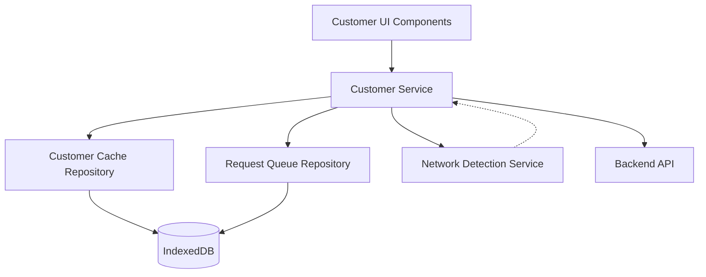

# Design Document: Customer Management

## Overview

The Customer Management module provides comprehensive customer relationship management for the Valvoline POS PWA application. It implements a network-first caching strategy with IndexedDB fallback for offline support, following the established architectural patterns in the codebase.

The module consists of:
- Customer search and lookup with multiple search criteria
- Full CRUD operations for customer profiles
- Vehicle management with VIN validation
- Service history viewing and filtering
- Loyalty program tracking and point redemption
- Customer analytics and insights
- Multi-channel communication capabilities
- Offline-first data synchronization

The design follows Angular standalone component architecture with strict TypeScript typing, reactive patterns using RxJS, and repository pattern for data persistence.

## Architecture

### High-Level Architecture



### Data Flow Patterns

**Network-First Strategy** (for reads):
1. Attempt API call
2. On success: cache response, return data
3. On failure: check cache, return cached data if available
4. If cache miss: return error with offline message

**Write-Through Strategy** (for writes):
1. Validate data locally
2. If online: send to API, update cache on success
3. If offline: save to cache, queue for sync
4. On reconnection: process queue with conflict resolution

### Component Structure

```
features/customer/
├── components/
│   ├── customer-search/
│   ├── customer-detail/
│   ├── customer-form/
│   ├── vehicle-list/
│   ├── vehicle-form/
│   ├── service-history/
│   └── loyalty-display/
├── services/
│   └── customer.service.ts
└── models/ (in core/models/)
    └── customer.model.ts

core/repositories/
├── customer-cache.repository.ts
└── indexeddb.repository.ts (existing)
```

## Components and Interfaces

### Customer Service

The CustomerService handles all customer-related API operations with offline support.

```typescript
interface CustomerService {
  // Search operations
  searchCustomers(criteria: CustomerSearchCriteria): Observable<CustomerSummary[]>
  getCustomerById(customerId: string): Observable<Customer | null>
  
  // CRUD operations
  createCustomer(customer: Partial<Customer>): Observable<Customer | null>
  updateCustomer(customerId: string, updates: Partial<Customer>): Observable<Customer | null>
  deleteCustomer(customerId: string): Observable<boolean>
  
  // Vehicle operations
  addVehicle(customerId: string, vehicle: Partial<CustomerVehicle>): Observable<CustomerVehicle | null>
  updateVehicle(customerId: string, vehicleId: string, updates: Partial<CustomerVehicle>): Observable<CustomerVehicle | null>
  removeVehicle(customerId: string, vehicleId: string): Observable<boolean>
  setPrimaryVehicle(customerId: string, vehicleId: string): Observable<boolean>
  
  // Service history operations
  getServiceHistory(customerId: string, filters?: ServiceHistoryFilters): Observable<ServiceRecord[]>
  getServiceRecordDetail(recordId: string): Observable<ServiceRecord | null>
  
  // Loyalty operations
  getLoyaltyStatus(customerId: string): Observable<LoyaltyProgram | null>
  redeemPoints(customerId: string, points: number, rewardId: string): Observable<LoyaltyTransaction | null>
  getPointsHistory(customerId: string): Observable<LoyaltyTransaction[]>
  
  // Analytics operations
  getCustomerAnalytics(customerId: string): Observable<CustomerAnalytics>
  
  // Communication operations
  sendEmail(customerId: string, template: EmailTemplate): Observable<boolean>
  sendSMS(customerId: string, message: string): Observable<boolean>
  exportCustomerData(customerId: string): Observable<Blob>
}
```

### Customer Cache Repository

Extends IndexedDBRepository to provide customer-specific caching with LRU eviction.

```typescript
interface CustomerCacheRepository {
  // Cache operations
  save(customer: Customer): Promise<void>
  getById(customerId: string): Promise<Customer | null>
  search(criteria: CustomerSearchCriteria): Promise<CustomerSummary[]>
  update(customerId: string, updates: Partial<Customer>): Promise<void>
  delete(customerId: string): Promise<void>
  
  // Cache management
  evictOldest(): Promise<void>
  clearCache(): Promise<void>
  getStats(): Promise<CacheStats>
  
  // Indexing for efficient search
  searchByPhone(phone: string): Promise<Customer[]>
  searchByEmail(email: string): Promise<Customer[]>
  searchByLastName(lastName: string): Promise<Customer[]>
  searchByVin(vin: string): Promise<Customer | null>
  searchByLicensePlate(plate: string): Promise<Customer | null>
}
```

### Validation Service

Provides reusable validation logic for customer and vehicle data.

```typescript
interface ValidationService {
  // Customer validation
  validatePhone(phone: string): ValidationResult
  validateEmail(email: string): ValidationResult
  validateZipCode(zip: string): ValidationResult
  validateState(state: string): ValidationResult
  validateCustomer(customer: Partial<Customer>): ValidationResult
  
  // Vehicle validation
  validateVin(vin: string): ValidationResult
  validateYear(year: number): ValidationResult
  validateVehicle(vehicle: Partial<CustomerVehicle>): ValidationResult
  
  // Duplicate detection
  checkDuplicatePhone(phone: string, excludeCustomerId?: string): Promise<boolean>
  checkDuplicateEmail(email: string, excludeCustomerId?: string): Promise<boolean>
  checkDuplicateVin(vin: string, excludeCustomerId?: string): Promise<boolean>
}

interface ValidationResult {
  isValid: boolean
  errors: string[]
}
```

### UI Components

**CustomerSearchComponent**:
- Search input with real-time validation
- Search results list with customer summaries
- Quick actions (view, edit, new service)
- Empty state with create customer option

**CustomerDetailComponent**:
- Customer information display
- Vehicle list with primary indicator
- Service history summary
- Loyalty status display
- Analytics dashboard
- Action buttons (edit, delete, communicate)

**CustomerFormComponent**:
- Reactive form with validation
- Address autocomplete
- Communication preferences
- Real-time duplicate detection
- Save/cancel actions

**VehicleListComponent**:
- Vehicle cards with key information
- Primary vehicle indicator
- Add vehicle button
- Edit/remove actions per vehicle

**VehicleFormComponent**:
- VIN lookup integration
- Year/make/model dropdowns
- Mileage tracking
- License plate input
- Set as primary checkbox

**ServiceHistoryComponent**:
- Chronological service list
- Date range filter
- Service type filter
- Expandable service details
- Print functionality

**LoyaltyDisplayComponent**:
- Points balance
- Tier badge
- Available rewards
- Points history
- Redeem points action

## Data Models

### Core Models

```typescript
interface Customer {
  id: string
  firstName: string
  lastName: string
  email: string
  phone: string
  alternatePhone?: string
  address: Address
  preferences: CustomerPreferences
  loyaltyProgram?: LoyaltyProgram
  createdDate: string
  lastVisitDate?: string
  totalVisits: number
  totalSpent: number
  vehicles: CustomerVehicle[]
  notes?: string
}

interface Address {
  street: string
  city: string
  state: string
  zipCode: string
  country: string
}

interface CustomerPreferences {
  emailNotifications: boolean
  smsNotifications: boolean
  marketingEmails: boolean
  preferredContactMethod: 'email' | 'phone' | 'sms'
  preferredLanguage: string
}

interface LoyaltyProgram {
  memberId: string
  points: number
  tier: 'Bronze' | 'Silver' | 'Gold' | 'Platinum'
  joinDate: string
  expirationDate?: string
}

interface CustomerVehicle {
  id: string
  vin: string
  year: number
  make: string
  model: string
  engine: string
  licensePlate?: string
  color?: string
  mileage: number
  isPrimary: boolean
  addedDate: string
  lastServiceDate?: string
  nextServiceDue?: string
}

interface ServiceRecord {
  id: string
  customerId: string
  vehicleId: string
  date: string
  storeId: string
  storeName: string
  services: ServiceItem[]
  totalAmount: number
  mileage: number
  technician: string
  notes?: string
  invoiceNumber: string
}

interface ServiceItem {
  id: string
  name: string
  category: ServiceCategory
  price: number
  quantity: number
  discount?: number
}

type ServiceCategory = 
  | 'Oil Change'
  | 'Fluid Service'
  | 'Filter Service'
  | 'Battery'
  | 'Wiper'
  | 'Light'
  | 'Tire'
  | 'Inspection'
  | 'Other'

interface CustomerSearchCriteria {
  searchTerm?: string
  phone?: string
  email?: string
  lastName?: string
  vehicleVin?: string
  licensePlate?: string
}

interface CustomerSummary {
  id: string
  name: string
  phone: string
  email: string
  lastVisit?: string
  totalVisits: number
  primaryVehicle?: string
  loyaltyTier?: string
}

interface ServiceHistoryFilters {
  startDate?: string
  endDate?: string
  serviceType?: ServiceCategory
  vehicleId?: string
}

interface CustomerAnalytics {
  totalVisits: number
  totalSpent: number
  averageTicketValue: number
  lastVisitDate?: string
  preferredServices: ServiceFrequency[]
  vehicleCount: number
}

interface ServiceFrequency {
  serviceName: string
  count: number
  category: ServiceCategory
}

interface LoyaltyTransaction {
  id: string
  date: string
  type: 'earned' | 'redeemed' | 'expired' | 'adjusted'
  points: number
  description: string
  relatedServiceId?: string
}

interface EmailTemplate {
  templateId: string
  subject: string
  body: string
  variables: Record<string, string>
}
```

### Cache Models

```typescript
interface CachedCustomer extends Customer {
  cachedAt: Date
  syncStatus: 'synced' | 'pending' | 'conflict'
}

interface QueuedCustomerOperation {
  id: string
  operation: 'create' | 'update' | 'delete'
  customerId?: string
  data?: Partial<Customer>
  timestamp: Date
  retryCount: number
  maxRetries: number
}
```


## Correctness Properties

*A property is a characteristic or behavior that should hold true across all valid executions of a system—essentially, a formal statement about what the system should do. Properties serve as the bridge between human-readable specifications and machine-verifiable correctness guarantees.*


### Property 1: Search Returns Matching Customers

*For any* customer database and search criteria (phone, email, last name, VIN, or license plate), all returned customers should match the search criteria on the specified field.

**Validates: Requirements 1.1, 1.2, 1.3, 1.4, 1.5**

### Property 2: Search Results Contain Required Information

*For any* search result set, each CustomerSummary should contain name, phone, email, last visit date, total visits, primary vehicle, and loyalty tier.

**Validates: Requirements 1.6**

### Property 3: Search Results Sorted by Last Visit

*For any* search result set with multiple customers, the results should be ordered by last visit date in descending order (most recent first).

**Validates: Requirements 1.8**

### Property 4: Customer Creation Assigns Unique ID

*For any* valid customer data, creating a customer should assign a unique identifier that differs from all existing customer IDs.

**Validates: Requirements 2.2**

### Property 5: Duplicate Prevention

*For any* existing customer and new customer data, if the new data contains a phone number or email address that matches an existing customer, the creation or update should be rejected.

**Validates: Requirements 2.3, 2.4, 3.4, 3.5, 11.8**

### Property 6: Required Field Validation

*For any* customer data missing required fields (firstName, lastName, or phone), submission should be rejected with validation errors identifying the missing fields.

**Validates: Requirements 2.5, 11.7**

### Property 7: Phone Number Validation

*For any* phone number string, validation should accept only 10-digit US format and reject all other formats.

**Validates: Requirements 2.6, 11.1**

### Property 8: Email Address Validation

*For any* email string, validation should accept only strings matching standard email format (local@domain.tld) and reject all other formats.

**Validates: Requirements 2.7, 11.2**

### Property 9: Customer Persistence to IndexedDB

*For any* successfully created or updated customer, the customer data should be retrievable from IndexedDB with all fields intact.

**Validates: Requirements 2.8, 3.7**

### Property 10: Offline Operations Queued

*For any* create, update, or delete operation performed while offline, the operation should be added to the synchronization queue with correct operation type and data.

**Validates: Requirements 2.9, 3.6, 5.5, 6.9, 8.7, 12.2**

### Property 11: Edit Form Pre-population

*For any* customer opened for editing, the form fields should be pre-populated with the current customer data values.

**Validates: Requirements 3.1**

### Property 12: Update Validation and Persistence

*For any* customer and valid update data, applying the update should validate all fields, persist changes to storage, and return the updated customer.

**Validates: Requirements 3.2**

### Property 13: Invalid Update Rejection

*For any* customer and invalid update data, attempting the update should be rejected with specific validation errors and the customer should remain unchanged.

**Validates: Requirements 3.3**

### Property 14: Customer Profile Display Completeness

*For any* customer, displaying the profile should show personal information, all vehicles, service history summary, loyalty status, and analytics sections.

**Validates: Requirements 4.2**

### Property 15: Analytics Calculation Accuracy

*For any* customer with service history, the displayed analytics (total visits, total spent, average ticket value, last visit date, preferred services, vehicle count) should be calculated correctly from the service records.

**Validates: Requirements 4.3, 9.1, 9.2, 9.3, 9.4, 9.5, 9.6**

### Property 16: Primary Vehicle Indication

*For any* customer with multiple vehicles, exactly one vehicle should be marked as primary and clearly indicated in the display.

**Validates: Requirements 4.4, 6.4**

### Property 17: Offline Data Display with Indicator

*For any* customer viewed while offline, the cached data should be displayed with a visual indicator showing offline status.

**Validates: Requirements 4.5, 7.7, 12.5**

### Property 18: Deletion Confirmation Required

*For any* customer deletion attempt, a confirmation dialog should be displayed containing the customer name and warning message before deletion proceeds.

**Validates: Requirements 5.1**

### Property 19: Deletion Removes Customer Data

*For any* confirmed customer deletion, the customer should no longer be retrievable from the system after deletion completes.

**Validates: Requirements 5.2**

### Property 20: Deletion Cancellation Preserves Data

*For any* customer deletion that is cancelled, the customer should remain in the system unchanged.

**Validates: Requirements 5.3**

### Property 21: Service History Archival on Deletion

*For any* customer with service history, deleting the customer should preserve the service records in an archived state rather than permanently deleting them.

**Validates: Requirements 5.4**

### Property 22: Vehicle Addition with VIN Validation

*For any* customer and vehicle data with valid VIN format, adding the vehicle should create a new Vehicle_Profile associated with the customer.

**Validates: Requirements 6.1**

### Property 23: VIN Uniqueness Enforcement

*For any* vehicle addition where the VIN already exists for another customer, the addition should be rejected with a conflict error.

**Validates: Requirements 6.2**

### Property 24: First Vehicle Auto-Primary

*For any* customer with no vehicles, adding a vehicle should automatically set it as the Primary_Vehicle.

**Validates: Requirements 6.3**

### Property 25: Primary Vehicle Exclusivity

*For any* customer with multiple vehicles, setting one vehicle as primary should ensure only that vehicle has isPrimary=true and all others have isPrimary=false.

**Validates: Requirements 6.4**

### Property 26: Vehicle Update Validation

*For any* vehicle and update data, applying the update should validate all fields and persist changes only if validation passes.

**Validates: Requirements 6.5**

### Property 27: Vehicle Removal Preserves Service Records

*For any* vehicle with service history, removing the vehicle should preserve all associated service records.

**Validates: Requirements 6.6**

### Property 28: Primary Vehicle Reassignment

*For any* customer with multiple vehicles, removing the Primary_Vehicle should automatically designate the vehicle with the most recent service date as the new Primary_Vehicle.

**Validates: Requirements 6.7**

### Property 29: VIN Format Validation

*For any* VIN string, validation should accept only strings with exactly 17 alphanumeric characters excluding I, O, and Q, and reject all other formats.

**Validates: Requirements 6.8, 11.5**

### Property 30: Service History Chronological Ordering

*For any* customer with service records, displaying the service history should show all records sorted by date in descending order (most recent first).

**Validates: Requirements 7.1**

### Property 31: Service History Date Range Filtering

*For any* service history and date range filter, all returned service records should have dates within the specified range (inclusive).

**Validates: Requirements 7.2**

### Property 32: Service History Type Filtering

*For any* service history and service type filter, all returned service records should contain at least one service item of the specified type.

**Validates: Requirements 7.3**

### Property 33: Service Record Detail Completeness

*For any* service record, displaying the detail view should show date, store, technician, services performed, parts used, total amount, mileage, and invoice number.

**Validates: Requirements 7.4**

### Property 34: Service History Print Completeness

*For any* customer service history, the generated printable document should contain all service records with complete information.

**Validates: Requirements 7.5**

### Property 35: Loyalty Information Display

*For any* customer with loyalty program enrollment, displaying the profile should show current points balance, loyalty tier, and available rewards.

**Validates: Requirements 8.1**

### Property 36: Points History Display

*For any* customer with loyalty transactions, displaying loyalty information should show all transactions with dates and descriptions.

**Validates: Requirements 8.2**

### Property 37: Point Redemption Updates Balance

*For any* customer with sufficient points and redemption request, redeeming points should decrease the balance by the redeemed amount and create a redemption transaction record.

**Validates: Requirements 8.3**

### Property 38: Loyalty Tier Recalculation

*For any* customer with points balance change, the loyalty tier should be recalculated based on tier thresholds (Bronze: 0-999, Silver: 1000-2499, Gold: 2500-4999, Platinum: 5000+).

**Validates: Requirements 8.4, 8.5**

### Property 39: Email Interface Pre-population

*For any* customer, initiating email communication should open an interface with the customer's email address pre-populated.

**Validates: Requirements 10.1**

### Property 40: SMS Interface Pre-population

*For any* customer, initiating SMS communication should open an interface with the customer's phone number pre-populated.

**Validates: Requirements 10.2**

### Property 41: Customer Print Document Completeness

*For any* customer, the generated printable document should contain customer details and all vehicle information.

**Validates: Requirements 10.3**

### Property 42: Customer Data Export Completeness

*For any* customer, the exported JSON file should contain the complete Customer_Profile with all nested data (vehicles, service history, loyalty).

**Validates: Requirements 10.4**

### Property 43: Marketing Opt-Out Warning

*For any* customer with marketing preferences set to opt-out, attempting to send marketing communication should display a warning before proceeding.

**Validates: Requirements 10.5**

### Property 44: Preferred Contact Method Respected

*For any* customer with a preferred contact method, sending communication should use the preferred method (email, phone, or SMS).

**Validates: Requirements 10.6**

### Property 45: ZIP Code Validation

*For any* ZIP code string, validation should accept only 5-digit format (12345) or 9-digit format (12345-6789) and reject all other formats.

**Validates: Requirements 11.3**

### Property 46: State Code Validation

*For any* state string, validation should accept only valid US state abbreviations (AL, AK, AZ, ..., WY) and reject all other values.

**Validates: Requirements 11.4**

### Property 47: Vehicle Year Validation

*For any* year value, validation should accept only 4-digit numbers between 1900 and (current year + 1) and reject all other values.

**Validates: Requirements 11.6**

### Property 48: Offline Read Access

*For any* cached customer, read operations should succeed while offline and return the cached data.

**Validates: Requirements 12.1**

### Property 49: Synchronization Queue Ordering

*For any* set of queued operations with timestamps, processing the queue should execute operations in chronological order (oldest first).

**Validates: Requirements 12.3**

### Property 50: Conflict Resolution Server Authority

*For any* synchronization conflict between local and server data, the server data should be applied and the employee should be notified of the conflict.

**Validates: Requirements 12.4**

### Property 51: Pending Sync Indicator

*For any* customer modified while offline, the display should show a visual indicator that synchronization is pending.

**Validates: Requirements 12.6**

### Property 52: Navigation Context Preservation

*For any* navigation sequence from search to detail and back, the search context (search term and results) should be preserved.

**Validates: Requirements 13.3**

### Property 53: Touch Target Minimum Size

*For any* interactive button in the customer management interface, the touch target should be at least 44x44 pixels.

**Validates: Requirements 13.4**

### Property 54: Success Confirmation Display

*For any* successful form submission, a success confirmation message should be displayed for exactly 3 seconds.

**Validates: Requirements 13.5**

### Property 55: Error Message Display

*For any* error condition, a clear error message with actionable guidance should be displayed to the employee.

**Validates: Requirements 13.6**

### Property 56: Keyboard Navigation Support

*For any* form or interactive element, tab navigation should follow logical order and common keyboard shortcuts (Enter to submit, Escape to cancel) should function correctly.

**Validates: Requirements 13.7**

### Property 57: HTTPS Protocol Usage

*For any* API call transmitting customer data, the URL should use HTTPS protocol.

**Validates: Requirements 15.1**

### Property 58: Manager Permission for Deletion

*For any* customer deletion attempt by an employee without manager-level permissions, the deletion should be rejected.

**Validates: Requirements 15.3**

### Property 59: Export Audit Logging

*For any* customer data export, an audit log entry should be created containing employee ID, customer ID, and timestamp.

**Validates: Requirements 15.4**

### Property 60: Credit Card Masking

*For any* customer with credit card information, displaying the data should show only the last 4 digits with the rest masked.

**Validates: Requirements 15.5**

### Property 61: Session Expiration Cleanup

*For any* session expiration event, all cached customer data should be cleared from memory.

**Validates: Requirements 15.6**

### Property 62: IndexedDB Serialization Round-Trip

*For any* valid Customer_Profile object, serializing to JSON, storing in IndexedDB, retrieving, and deserializing should produce an equivalent Customer_Profile object.

**Validates: Requirements 16.1, 16.2**

### Property 63: API Serialization Round-Trip

*For any* valid Customer_Profile object, serializing to JSON, sending to API, receiving response, and deserializing should produce an equivalent Customer_Profile object.

**Validates: Requirements 16.3, 16.4**

### Property 64: ISO 8601 Date Format

*For any* date field in customer data, serialization should produce a string in ISO 8601 format (YYYY-MM-DDTHH:mm:ss.sssZ).

**Validates: Requirements 16.5**

### Property 65: Currency Precision Preservation

*For any* currency value in customer data, serializing and deserializing should preserve exactly 2 decimal places of precision.

**Validates: Requirements 16.6**

## Error Handling

### Error Categories

The system implements structured error handling with the following categories:

1. **Validation Errors**: Invalid input data (phone format, email format, required fields)
2. **Conflict Errors**: Duplicate detection (phone, email, VIN already exists)
3. **Network Errors**: API communication failures, timeout errors
4. **Not Found Errors**: Customer or vehicle not found
5. **Permission Errors**: Insufficient permissions for operation
6. **Storage Errors**: IndexedDB operation failures
7. **Sync Errors**: Synchronization conflicts or failures

### Error Handling Strategy

**Validation Errors**:
- Display inline field-level errors
- Prevent form submission
- Highlight invalid fields
- Provide specific error messages

**Conflict Errors**:
- Display modal dialog with conflict details
- Offer to view existing record
- Prevent duplicate creation
- Log conflict for audit

**Network Errors**:
- Attempt cache fallback for reads
- Queue operations for retry
- Display offline indicator
- Provide retry action

**Not Found Errors**:
- Display friendly "not found" message
- Offer to search again or create new
- Log for debugging

**Permission Errors**:
- Display access denied message
- Explain required permission level
- Log unauthorized attempt

**Storage Errors**:
- Attempt operation retry
- Fall back to memory-only mode
- Notify user of storage issue
- Log error for support

**Sync Errors**:
- Display conflict resolution dialog
- Apply server-authoritative resolution
- Notify employee of changes
- Log conflict details

### Error Recovery

The system implements automatic error recovery:

1. **Exponential Backoff**: Failed API calls retry with increasing delays (1s, 2s, 4s, 8s, 16s)
2. **Queue Persistence**: Failed operations persist in IndexedDB across app restarts
3. **Automatic Sync**: Queue processing triggers automatically on network restoration
4. **Conflict Resolution**: Server data is authoritative, local changes are overwritten with notification
5. **Graceful Degradation**: System remains functional with cached data during network issues

## Testing Strategy

### Dual Testing Approach

The Customer Management module requires both unit testing and property-based testing for comprehensive coverage:

**Unit Tests**: Verify specific examples, edge cases, and error conditions
- Empty search results display
- Empty service history display
- No loyalty program enrollment display
- Offline cache miss scenarios
- Specific validation error messages
- Component rendering with specific data
- Integration between components

**Property Tests**: Verify universal properties across all inputs
- All correctness properties listed above
- Minimum 100 iterations per property test
- Random data generation for customers, vehicles, service records
- Each test tagged with: **Feature: customer-management, Property N: [property text]**

### Property-Based Testing Library

**Library**: fast-check (TypeScript/JavaScript property-based testing library)

**Configuration**:
```typescript
import * as fc from 'fast-check'

// Example property test configuration
fc.assert(
  fc.property(
    fc.record({
      firstName: fc.string({ minLength: 1, maxLength: 50 }),
      lastName: fc.string({ minLength: 1, maxLength: 50 }),
      phone: fc.string({ minLength: 10, maxLength: 10 }).map(s => s.replace(/\D/g, '')),
      email: fc.emailAddress()
    }),
    (customerData) => {
      // Test property
    }
  ),
  { numRuns: 100 }
)
```

### Test Organization

```
features/customer/
├── services/
│   └── customer.service.spec.ts (unit tests)
│   └── customer.service.property.spec.ts (property tests)
├── components/
│   ├── customer-search/
│   │   └── customer-search.component.spec.ts (unit tests)
│   ├── customer-detail/
│   │   └── customer-detail.component.spec.ts (unit tests)
│   └── customer-form/
│       └── customer-form.component.spec.ts (unit tests)
│       └── customer-form.property.spec.ts (property tests)
└── repositories/
    └── customer-cache.repository.spec.ts (unit tests)
    └── customer-cache.repository.property.spec.ts (property tests)
```

### Testing Priorities

**High Priority** (implement first):
- Property 5: Duplicate Prevention
- Property 62: IndexedDB Serialization Round-Trip
- Property 63: API Serialization Round-Trip
- Property 29: VIN Format Validation
- Property 10: Offline Operations Queued
- Property 49: Synchronization Queue Ordering

**Medium Priority**:
- All search properties (1-3)
- All validation properties (6-8, 45-47)
- All analytics properties (15)
- All vehicle management properties (22-28)

**Lower Priority**:
- UI-specific properties (52-56)
- Communication properties (39-44)
- Display completeness properties (14, 33-36)

### Integration Testing

Integration tests should verify:
- Customer search → detail view → edit → save flow
- Customer creation → vehicle addition → service history flow
- Offline operation → queue → sync → conflict resolution flow
- Loyalty point earning → tier upgrade → reward redemption flow

### Manual Testing Checklist

The following aspects require manual testing:
- Visual design and layout consistency
- Touch interaction responsiveness
- Loading state animations
- Error message clarity and helpfulness
- Print output formatting
- Email/SMS composition interface usability
- Overall user experience and workflow efficiency

