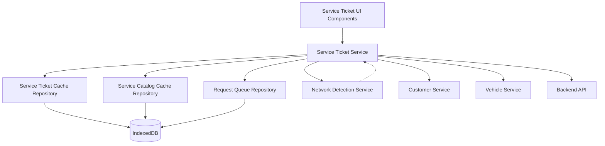

# Design Document: Service Ticket Management

## Overview

The Service Ticket Management module is the core operational component of the Valvoline POS PWA application. It enables service advisors and technicians to create, manage, and complete service tickets throughout the customer service lifecycle. The module implements a network-first caching strategy with IndexedDB fallback for offline support, following the established architectural patterns in the codebase.

The module consists of:
- Service ticket creation with customer and vehicle selection
- Service catalog with 8 categories and comprehensive pricing
- Real-time pricing calculations with tax and discount support
- Service recommendations based on mileage and service history
- Technician assignment and workload tracking
- Status workflow management (Created → In Progress → Completed → Paid)
- Parts and labor tracking with separate cost accounting
- Manager approval workflow for discounts
- Work order printing for technician reference
- Offline-first data synchronization with LRU cache eviction
- Integration with customer and vehicle data

The design follows Angular standalone component architecture with strict TypeScript typing, reactive patterns using RxJS, and repository pattern for data persistence.

## Architecture

### High-Level Architecture



### Data Flow Patterns

**Network-First Strategy** (for reads):
1. Attempt API call
2. On success: cache response, return data
3. On failure: check cache, return cached data if available
4. If cache miss: return error with offline message


**Write-Through Strategy** (for writes):
1. Validate data locally
2. If online: send to API, update cache on success
3. If offline: save to cache, queue for sync
4. On reconnection: process queue with conflict resolution

**Catalog Caching Strategy**:
1. Download complete service catalog on first load
2. Cache to IndexedDB with version tracking
3. Refresh catalog daily or on version change
4. Use cached catalog for all offline operations

### Component Structure

```
features/service-ticket/
├── components/
│   ├── ticket-list/
│   ├── ticket-detail/
│   ├── ticket-form/
│   ├── service-catalog/
│   ├── service-selector/
│   ├── ticket-summary/
│   ├── recommendation-panel/
│   ├── technician-selector/
│   └── work-order-print/
├── services/
│   └── service-ticket.service.ts
└── models/ (in core/models/)
    ├── service-ticket.model.ts
    └── service-catalog.model.ts

core/repositories/
├── service-ticket-cache.repository.ts
├── service-catalog-cache.repository.ts
└── indexeddb.repository.ts (existing)
```

## Components and Interfaces

### Service Ticket Service

The ServiceTicketService handles all ticket-related API operations with offline support.

```typescript
interface ServiceTicketService {
  // Ticket CRUD operations
  createTicket(ticket: Partial<ServiceTicket>): Observable<ServiceTicket | null>
  getTicketById(ticketId: string): Observable<ServiceTicket | null>
  updateTicket(ticketId: string, updates: Partial<ServiceTicket>): Observable<ServiceTicket | null>
  deleteTicket(ticketId: string): Observable<boolean>
  
  // Ticket search and listing
  searchTickets(criteria: TicketSearchCriteria): Observable<TicketSummary[]>
  getTicketsByStatus(status: TicketStatus): Observable<TicketSummary[]>
  getTicketsByTechnician(technicianId: string): Observable<TicketSummary[]>
  getTicketsByDateRange(startDate: string, endDate: string): Observable<TicketSummary[]>
  
  // Service catalog operations
  getServiceCatalog(): Observable<ServiceCatalog>
  getServicesByCategory(category: ServiceCategory): Observable<ServiceItem[]>
  getServiceById(serviceId: string): Observable<ServiceItem | null>
  
  // Ticket line item operations
  addLineItem(ticketId: string, lineItem: TicketLineItem): Observable<ServiceTicket | null>
  updateLineItem(ticketId: string, lineItemId: string, updates: Partial<TicketLineItem>): Observable<ServiceTicket | null>
  removeLineItem(ticketId: string, lineItemId: string): Observable<ServiceTicket | null>
  
  // Pricing operations
  calculateTicketTotals(ticket: ServiceTicket): TicketTotals
  applyDiscount(ticketId: string, discount: Discount): Observable<ServiceTicket | null>
  removeDiscount(ticketId: string, discountId: string): Observable<ServiceTicket | null>
  
  // Status workflow operations
  updateTicketStatus(ticketId: string, newStatus: TicketStatus): Observable<ServiceTicket | null>
  startWork(ticketId: string): Observable<ServiceTicket | null>
  completeWork(ticketId: string): Observable<ServiceTicket | null>
  markPaid(ticketId: string): Observable<ServiceTicket | null>
  
  // Technician operations
  assignTechnician(ticketId: string, technicianId: string): Observable<ServiceTicket | null>
  getEstimatedCompletionTime(ticketId: string): number
  
  // Recommendation operations
  getServiceRecommendations(vehicleId: string, currentMileage: number): Observable<ServiceRecommendation[]>
  getUpsellRecommendations(ticketId: string): Observable<ServiceRecommendation[]>
  
  // Work order operations
  generateWorkOrder(ticketId: string): Observable<WorkOrder>
  printWorkOrder(ticketId: string): Observable<Blob>
  
  // Offline operations
  syncPendingTickets(): Observable<SyncResult>
  getPendingTicketCount(): Observable<number>
}
```


### Service Ticket Cache Repository

Extends IndexedDBRepository to provide ticket-specific caching with LRU eviction.

```typescript
interface ServiceTicketCacheRepository {
  // Cache operations
  save(ticket: ServiceTicket): Promise<void>
  getById(ticketId: string): Promise<ServiceTicket | null>
  search(criteria: TicketSearchCriteria): Promise<TicketSummary[]>
  update(ticketId: string, updates: Partial<ServiceTicket>): Promise<void>
  delete(ticketId: string): Promise<void>
  
  // Cache management with LRU
  evictOldest(): Promise<void>
  clearCache(): Promise<void>
  getStats(): Promise<CacheStats>
  updateAccessTime(ticketId: string): Promise<void>
  
  // Indexing for efficient search
  searchByTicketNumber(ticketNumber: string): Promise<ServiceTicket | null>
  searchByCustomer(customerId: string): Promise<ServiceTicket[]>
  searchByVehicle(vehicleId: string): Promise<ServiceTicket[]>
  searchByStatus(status: TicketStatus): Promise<ServiceTicket[]>
  searchByTechnician(technicianId: string): Promise<ServiceTicket[]>
  searchByDateRange(startDate: string, endDate: string): Promise<ServiceTicket[]>
  
  // Queue protection
  getTicketsInQueue(): Promise<string[]>
  isTicketInQueue(ticketId: string): Promise<boolean>
}
```

### Service Catalog Cache Repository

Manages caching of the service catalog for offline access.

```typescript
interface ServiceCatalogCacheRepository {
  // Catalog operations
  saveCatalog(catalog: ServiceCatalog): Promise<void>
  getCatalog(): Promise<ServiceCatalog | null>
  getCatalogVersion(): Promise<string | null>
  
  // Service item operations
  getServiceById(serviceId: string): Promise<ServiceItem | null>
  getServicesByCategory(category: ServiceCategory): Promise<ServiceItem[]>
  searchServices(query: string): Promise<ServiceItem[]>
  
  // Cache management
  clearCatalog(): Promise<void>
  getCatalogMetadata(): Promise<CatalogMetadata>
}
```

### Validation Service Extensions

Extends existing ValidationService with ticket-specific validation.

```typescript
interface TicketValidationService {
  // Ticket validation
  validateTicket(ticket: Partial<ServiceTicket>): ValidationResult
  validateLineItem(lineItem: Partial<TicketLineItem>): ValidationResult
  validateDiscount(discount: Discount, subtotal: number): ValidationResult
  validateStatusTransition(currentStatus: TicketStatus, newStatus: TicketStatus): ValidationResult
  
  // Business rule validation
  requiresManagerApproval(discount: Discount, subtotal: number): boolean
  canEditTicket(status: TicketStatus): boolean
  canDeleteTicket(status: TicketStatus): boolean
  
  // Data validation
  validateMileage(mileage: number): ValidationResult
  validateQuantity(quantity: number): ValidationResult
  validatePrice(price: number): ValidationResult
  validateTaxRate(taxRate: number): ValidationResult
}
```

### UI Components

**TicketListComponent**:
- Ticket list with status indicators
- Search and filter controls
- Sort options (date, status, customer)
- Quick actions (view, edit, print)
- Create new ticket button
- Pagination for large result sets

**TicketDetailComponent**:
- Complete ticket information display
- Customer and vehicle summary
- Service line items with pricing
- Parts and labor breakdown
- Status timeline
- Technician assignment
- Action buttons (edit, print, change status)

**TicketFormComponent**:
- Customer selection with search
- Vehicle selection from customer vehicles
- Current mileage input
- Service catalog browser
- Selected services list
- Real-time pricing display
- Discount application
- Technician assignment
- Save/cancel actions

**ServiceCatalogComponent**:
- Category navigation
- Service grid/list view
- Service details on hover
- Add to ticket action
- Search functionality
- Price display with labor time

**ServiceSelectorComponent**:
- Quick service selection
- Category tabs
- Service cards with pricing
- Quantity adjustment
- Add/remove actions

**TicketSummaryComponent**:
- Line items list
- Subtotal display
- Tax calculation display
- Discount display
- Total display
- Parts vs labor breakdown

**RecommendationPanelComponent**:
- Recommended services list
- Reason for recommendation
- Last performed date
- Accept/dismiss actions
- Priority indicators

**TechnicianSelectorComponent**:
- Available technicians list
- Current workload indicator
- Estimated completion time
- Assignment action

**WorkOrderPrintComponent**:
- Printable work order layout
- Customer and vehicle info
- Service checklist
- Parts list
- Signature lines
- Barcode/QR code

## Data Models

### Core Models

```typescript
interface ServiceTicket {
  id: string
  ticketNumber: string
  customerId: string
  customerName: string
  vehicleId: string
  vehicleInfo: VehicleInfo
  status: TicketStatus
  lineItems: TicketLineItem[]
  subtotal: number
  tax: number
  taxRate: number
  discounts: Discount[]
  total: number
  partsTotal: number
  laborTotal: number
  totalLaborMinutes: number
  assignedTechnicianId?: string
  assignedTechnicianName?: string
  estimatedCompletionTime?: string
  createdBy: string
  createdDate: string
  startedDate?: string
  completedDate?: string
  paidDate?: string
  currentMileage: number
  notes?: string
  statusHistory: StatusHistoryEntry[]
}

type TicketStatus = 'Created' | 'In_Progress' | 'Completed' | 'Paid'

interface VehicleInfo {
  id: string
  vin: string
  year: number
  make: string
  model: string
  licensePlate?: string
}


interface TicketLineItem {
  id: string
  serviceId: string
  serviceName: string
  category: ServiceCategory
  quantity: number
  unitPrice: number
  lineTotal: number
  partsCost: number
  laborCost: number
  laborMinutes: number
  partNumbers?: string[]
  notes?: string
}

type ServiceCategory = 
  | 'Oil_Change'
  | 'Fluid_Services'
  | 'Filters'
  | 'Battery'
  | 'Wipers'
  | 'Lights'
  | 'Tires'
  | 'Inspection'

interface Discount {
  id: string
  type: 'percentage' | 'amount'
  value: number
  amount: number
  reason: string
  appliedBy: string
  appliedDate: string
  approvedBy?: string
  approvalDate?: string
  requiresApproval: boolean
}

interface StatusHistoryEntry {
  status: TicketStatus
  timestamp: string
  employeeId: string
  employeeName: string
}

interface TicketTotals {
  subtotal: number
  tax: number
  discountTotal: number
  total: number
  partsTotal: number
  laborTotal: number
  totalLaborMinutes: number
}

interface TicketSearchCriteria {
  ticketNumber?: string
  customerId?: string
  customerName?: string
  vehicleId?: string
  vehicleVin?: string
  status?: TicketStatus
  technicianId?: string
  startDate?: string
  endDate?: string
}

interface TicketSummary {
  id: string
  ticketNumber: string
  customerName: string
  vehicleInfo: string
  status: TicketStatus
  total: number
  assignedTechnician?: string
  createdDate: string
  serviceCount: number
}


### Service Catalog Models

```typescript
interface ServiceCatalog {
  version: string
  lastUpdated: string
  categories: ServiceCategoryGroup[]
  services: ServiceItem[]
}

interface ServiceCategoryGroup {
  category: ServiceCategory
  displayName: string
  description: string
  icon: string
  sortOrder: number
}

interface ServiceItem {
  id: string
  code: string
  name: string
  category: ServiceCategory
  description: string
  basePrice: number
  partsCost: number
  laborCost: number
  laborMinutes: number
  pricingTiers?: PricingTier[]
  requiredParts?: PartInfo[]
  tags: string[]
  isActive: boolean
}

interface PricingTier {
  vehicleType: 'Standard' | 'European' | 'Diesel' | 'Synthetic'
  price: number
  partsCost: number
  laborCost: number
}

interface PartInfo {
  partNumber: string
  description: string
  quantity: number
  unitCost: number
}

interface CatalogMetadata {
  version: string
  lastUpdated: string
  serviceCount: number
  categoryCount: number
}
```

### Recommendation Models

```typescript
interface ServiceRecommendation {
  serviceId: string
  serviceName: string
  category: ServiceCategory
  reason: RecommendationReason
  priority: 'High' | 'Medium' | 'Low'
  estimatedPrice: number
  lastPerformedDate?: string
  lastPerformedMileage?: number
  dueAtMileage?: number
  dueByDate?: string
}

type RecommendationReason = 
  | 'Mileage_Due'
  | 'Time_Due'
  | 'Never_Performed'
  | 'Related_Service'
  | 'Seasonal'
  | 'Manufacturer_Recommended'

interface MileageThreshold {
  serviceId: string
  intervalMiles: number
  description: string
}

interface TimeThreshold {
  serviceId: string
  intervalMonths: number
  description: string
}
```

### Work Order Models

```typescript
interface WorkOrder {
  ticketNumber: string
  generatedDate: string
  customer: CustomerInfo
  vehicle: VehicleInfo
  services: WorkOrderService[]
  parts: WorkOrderPart[]
  laborSummary: LaborSummary
  pricingSummary: PricingSummary
  technician?: TechnicianInfo
  instructions?: string
  barcodeData: string
}

interface CustomerInfo {
  name: string
  phone: string
  email?: string
}

interface WorkOrderService {
  name: string
  description: string
  laborMinutes: number
  completed: boolean
}

interface WorkOrderPart {
  partNumber: string
  description: string
  quantity: number
}

interface LaborSummary {
  totalMinutes: number
  totalHours: number
  estimatedCompletionTime: string
}

interface PricingSummary {
  subtotal: number
  tax: number
  discounts: number
  total: number
}

interface TechnicianInfo {
  id: string
  name: string
  certifications?: string[]
}
```

### Cache Models

```typescript
interface CachedServiceTicket extends ServiceTicket {
  cachedAt: Date
  lastAccessedAt: Date
  syncStatus: 'synced' | 'pending' | 'conflict'
  accessCount: number
}

interface QueuedTicketOperation {
  id: string
  operation: 'create' | 'update' | 'delete' | 'status_change'
  ticketId?: string
  data?: Partial<ServiceTicket>
  timestamp: Date
  retryCount: number
  maxRetries: number
}

interface CacheStats {
  totalTickets: number
  ticketsByStatus: Record<TicketStatus, number>
  oldestTicket: Date
  newestTicket: Date
  totalSize: number
  pendingSync: number
}
```


## Pricing Calculation Logic

### Calculation Flow

The pricing calculation follows this sequence:

1. **Line Item Calculation**:
   - Line Total = Unit Price × Quantity
   - Parts Cost = Parts Cost per Unit × Quantity
   - Labor Cost = Labor Cost per Unit × Quantity

2. **Subtotal Calculation**:
   - Subtotal = Sum of all Line Totals
   - Parts Total = Sum of all Parts Costs
   - Labor Total = Sum of all Labor Costs

3. **Discount Application**:
   - For percentage discounts: Discount Amount = Subtotal × (Percentage / 100)
   - For amount discounts: Discount Amount = Discount Value
   - Multiple discounts applied sequentially
   - Discount Total = Sum of all Discount Amounts

4. **Tax Calculation**:
   - Taxable Amount = Subtotal - Discount Total
   - Tax = Taxable Amount × Tax Rate
   - Round to 2 decimal places

5. **Total Calculation**:
   - Total = Subtotal - Discount Total + Tax

### Calculation Pseudocode

```
function calculateTicketTotals(ticket: ServiceTicket): TicketTotals {
  // Step 1: Calculate line item totals
  let subtotal = 0
  let partsTotal = 0
  let laborTotal = 0
  let totalLaborMinutes = 0
  
  for each lineItem in ticket.lineItems {
    lineItem.lineTotal = lineItem.unitPrice * lineItem.quantity
    subtotal = subtotal + lineItem.lineTotal
    partsTotal = partsTotal + (lineItem.partsCost * lineItem.quantity)
    laborTotal = laborTotal + (lineItem.laborCost * lineItem.quantity)
    totalLaborMinutes = totalLaborMinutes + (lineItem.laborMinutes * lineItem.quantity)
  }
  
  // Step 2: Calculate discount total
  let discountTotal = 0
  for each discount in ticket.discounts {
    if discount.type == 'percentage' {
      discount.amount = round(subtotal * (discount.value / 100), 2)
    } else {
      discount.amount = discount.value
    }
    discountTotal = discountTotal + discount.amount
  }
  
  // Step 3: Calculate tax
  let taxableAmount = subtotal - discountTotal
  let tax = round(taxableAmount * ticket.taxRate, 2)
  
  // Step 4: Calculate total
  let total = subtotal - discountTotal + tax
  
  return {
    subtotal: round(subtotal, 2),
    tax: round(tax, 2),
    discountTotal: round(discountTotal, 2),
    total: round(total, 2),
    partsTotal: round(partsTotal, 2),
    laborTotal: round(laborTotal, 2),
    totalLaborMinutes: totalLaborMinutes
  }
}

function round(value: number, decimals: number): number {
  return Math.round(value * Math.pow(10, decimals)) / Math.pow(10, decimals)
}
```


## Service Recommendation Logic

### Recommendation Engine

The recommendation engine analyzes vehicle service history and current mileage to suggest services.

```
function getServiceRecommendations(
  vehicleId: string,
  currentMileage: number,
  serviceHistory: ServiceRecord[]
): ServiceRecommendation[] {
  
  let recommendations = []
  let mileageThresholds = loadMileageThresholds()
  let timeThresholds = loadTimeThresholds()
  
  // Check mileage-based recommendations
  for each threshold in mileageThresholds {
    let lastService = findLastService(serviceHistory, threshold.serviceId)
    
    if lastService == null {
      // Never performed
      recommendations.add({
        serviceId: threshold.serviceId,
        reason: 'Never_Performed',
        priority: 'High',
        dueAtMileage: threshold.intervalMiles
      })
    } else {
      let mileageSinceService = currentMileage - lastService.mileage
      
      if mileageSinceService >= threshold.intervalMiles {
        // Due by mileage
        recommendations.add({
          serviceId: threshold.serviceId,
          reason: 'Mileage_Due',
          priority: 'High',
          lastPerformedMileage: lastService.mileage,
          dueAtMileage: lastService.mileage + threshold.intervalMiles
        })
      } else if mileageSinceService >= (threshold.intervalMiles * 0.8) {
        // Approaching due
        recommendations.add({
          serviceId: threshold.serviceId,
          reason: 'Mileage_Due',
          priority: 'Medium',
          lastPerformedMileage: lastService.mileage,
          dueAtMileage: lastService.mileage + threshold.intervalMiles
        })
      }
    }
  }
  
  // Check time-based recommendations
  let currentDate = new Date()
  for each threshold in timeThresholds {
    let lastService = findLastService(serviceHistory, threshold.serviceId)
    
    if lastService != null {
      let monthsSinceService = calculateMonthsDifference(lastService.date, currentDate)
      
      if monthsSinceService >= threshold.intervalMonths {
        // Due by time
        recommendations.add({
          serviceId: threshold.serviceId,
          reason: 'Time_Due',
          priority: 'High',
          lastPerformedDate: lastService.date
        })
      }
    }
  }
  
  // Sort by priority and return
  return sortByPriority(recommendations)
}

function getUpsellRecommendations(ticket: ServiceTicket): ServiceRecommendation[] {
  let recommendations = []
  let upsellRules = loadUpsellRules()
  
  for each lineItem in ticket.lineItems {
    let rules = upsellRules.filter(rule => rule.triggerServiceId == lineItem.serviceId)
    
    for each rule in rules {
      // Check if already on ticket
      let alreadyAdded = ticket.lineItems.some(item => item.serviceId == rule.recommendedServiceId)
      
      if !alreadyAdded {
        recommendations.add({
          serviceId: rule.recommendedServiceId,
          reason: 'Related_Service',
          priority: rule.priority
        })
      }
    }
  }
  
  return recommendations
}
```

### Recommendation Rules

**Mileage-Based Thresholds**:
- Oil Change: Every 3,000-7,500 miles (varies by oil type)
- Air Filter: Every 15,000 miles
- Cabin Filter: Every 15,000 miles
- Transmission Fluid: Every 30,000 miles
- Coolant Flush: Every 30,000 miles
- Brake Fluid: Every 30,000 miles
- Tire Rotation: Every 5,000-7,500 miles

**Time-Based Thresholds**:
- Oil Change: Every 6 months (if mileage not reached)
- Battery Test: Every 12 months
- Coolant Flush: Every 24 months
- Brake Fluid: Every 24 months

**Upsell Rules**:
- Oil Change → Air Filter, Cabin Filter, Wiper Blades
- Battery Replacement → Battery Terminal Cleaning
- Tire Service → Tire Rotation, Wheel Alignment
- Any Service → Multi-Point Inspection


## Status Workflow Logic

### Valid Status Transitions

The ticket status follows a strict workflow with validation:

```
Created → In_Progress → Completed → Paid
```

**Valid Transitions**:
- Created → In_Progress (technician starts work)
- In_Progress → Completed (work finished)
- Completed → Paid (payment processed)
- In_Progress → Created (work paused/reset - manager only)

**Invalid Transitions** (must be rejected):
- Created → Completed (must go through In_Progress)
- Created → Paid (must go through In_Progress and Completed)
- In_Progress → Paid (must go through Completed)
- Completed → Created (cannot revert after completion)
- Completed → In_Progress (cannot revert after completion)
- Paid → any status (final state)

### Status Transition Validation

```
function validateStatusTransition(
  currentStatus: TicketStatus,
  newStatus: TicketStatus,
  userRole: string
): ValidationResult {
  
  // Define valid transitions
  let validTransitions = {
    'Created': ['In_Progress'],
    'In_Progress': ['Completed', 'Created'],
    'Completed': ['Paid'],
    'Paid': []
  }
  
  // Check if transition is valid
  if !validTransitions[currentStatus].includes(newStatus) {
    return {
      isValid: false,
      errors: [`Cannot transition from ${currentStatus} to ${newStatus}`]
    }
  }
  
  // Check manager permission for reverting
  if currentStatus == 'In_Progress' && newStatus == 'Created' {
    if userRole != 'Manager' {
      return {
        isValid: false,
        errors: ['Manager permission required to revert ticket status']
      }
    }
  }
  
  return { isValid: true, errors: [] }
}
```

### Edit Restrictions by Status

```
function canEditTicket(status: TicketStatus): boolean {
  return status == 'Created' || status == 'In_Progress'
}

function canDeleteTicket(status: TicketStatus): boolean {
  return status == 'Created'
}

function canAddServices(status: TicketStatus): boolean {
  return status == 'Created' || status == 'In_Progress'
}

function canApplyDiscount(status: TicketStatus): boolean {
  return status == 'Created' || status == 'In_Progress'
}
```


## Discount Authorization Logic

### Manager Approval Requirements

Discounts exceeding 10% of subtotal require manager approval.

```
function requiresManagerApproval(discount: Discount, subtotal: number): boolean {
  let discountAmount = 0
  
  if discount.type == 'percentage' {
    discountAmount = subtotal * (discount.value / 100)
  } else {
    discountAmount = discount.value
  }
  
  let discountPercentage = (discountAmount / subtotal) * 100
  
  return discountPercentage > 10
}

function applyDiscount(
  ticket: ServiceTicket,
  discount: Discount,
  currentUser: Employee
): Result<ServiceTicket> {
  
  // Validate discount
  if discount.value < 0 {
    return Error('Discount value must be non-negative')
  }
  
  if discount.type == 'percentage' && discount.value > 100 {
    return Error('Discount percentage cannot exceed 100%')
  }
  
  if discount.type == 'amount' && discount.value > ticket.subtotal {
    return Error('Discount amount cannot exceed subtotal')
  }
  
  // Check if approval required
  let needsApproval = requiresManagerApproval(discount, ticket.subtotal)
  
  if needsApproval {
    if currentUser.role != 'Manager' {
      discount.requiresApproval = true
      discount.approvedBy = null
      // Queue for manager approval
      return Error('Manager approval required for this discount')
    } else {
      discount.requiresApproval = true
      discount.approvedBy = currentUser.id
      discount.approvalDate = new Date().toISOString()
    }
  } else {
    discount.requiresApproval = false
  }
  
  // Calculate discount amount
  if discount.type == 'percentage' {
    discount.amount = round(ticket.subtotal * (discount.value / 100), 2)
  } else {
    discount.amount = discount.value
  }
  
  // Add to ticket
  ticket.discounts.push(discount)
  
  // Recalculate totals
  let totals = calculateTicketTotals(ticket)
  ticket.subtotal = totals.subtotal
  ticket.tax = totals.tax
  ticket.total = totals.total
  
  return Success(ticket)
}
```


## LRU Cache Eviction Strategy

### Eviction Logic

The cache implements Least Recently Used (LRU) eviction to manage storage limits.

```
function checkAndEvictIfNeeded(): void {
  let storageInfo = getStorageInfo()
  
  // Trigger eviction at 80% capacity
  if storageInfo.percentUsed >= 80 {
    evictUntilThreshold(70)
  }
}

function evictUntilThreshold(targetPercent: number): void {
  let storageInfo = getStorageInfo()
  
  while storageInfo.percentUsed > targetPercent {
    // Get all cached tickets sorted by last access time
    let tickets = getAllCachedTickets()
    let sortedTickets = sortByLastAccessTime(tickets, 'ascending')
    
    // Find eviction candidate
    let candidate = null
    for each ticket in sortedTickets {
      // Skip tickets in queue
      if isTicketInQueue(ticket.id) {
        continue
      }
      
      // Skip active tickets (Created or In_Progress)
      if ticket.status == 'Created' || ticket.status == 'In_Progress' {
        continue
      }
      
      // Found candidate
      candidate = ticket
      break
    }
    
    if candidate == null {
      // No evictable tickets found
      break
    }
    
    // Evict the ticket
    deleteFromCache(candidate.id)
    logEviction(candidate.id, candidate.ticketNumber)
    
    // Recalculate storage
    storageInfo = getStorageInfo()
  }
}

function updateAccessTime(ticketId: string): void {
  let ticket = getFromCache(ticketId)
  if ticket != null {
    ticket.lastAccessedAt = new Date()
    ticket.accessCount = ticket.accessCount + 1
    saveToCache(ticket)
  }
}
```

### Eviction Priority

Tickets are evicted in this priority order (lowest priority evicted first):

1. Paid tickets (oldest access time first)
2. Completed tickets (oldest access time first)
3. Created tickets (oldest access time first)
4. In_Progress tickets (only if no other options)
5. Tickets in sync queue (never evicted)


## Offline Synchronization Strategy

### Queue Management

The system queues all write operations performed offline for later synchronization.

```
function createTicketOffline(ticket: Partial<ServiceTicket>): ServiceTicket {
  // Generate temporary ID
  let tempId = generateTempId()
  
  // Create ticket with temp ID
  let newTicket = {
    ...ticket,
    id: tempId,
    ticketNumber: generateTicketNumber(),
    status: 'Created',
    createdDate: new Date().toISOString(),
    statusHistory: [{
      status: 'Created',
      timestamp: new Date().toISOString(),
      employeeId: currentUser.id,
      employeeName: currentUser.name
    }]
  }
  
  // Save to cache
  saveToCache(newTicket)
  
  // Queue for sync
  queueOperation({
    id: generateOperationId(),
    operation: 'create',
    ticketId: tempId,
    data: newTicket,
    timestamp: new Date(),
    retryCount: 0,
    maxRetries: 3
  })
  
  return newTicket
}

function syncPendingTickets(): SyncResult {
  let queue = getOperationQueue()
  let results = {
    successful: 0,
    failed: 0,
    conflicts: 0
  }
  
  // Sort by timestamp (chronological order)
  let sortedQueue = sortByTimestamp(queue, 'ascending')
  
  for each operation in sortedQueue {
    try {
      if operation.operation == 'create' {
        let response = apiCreateTicket(operation.data)
        
        // Update cache with server ID
        updateCacheId(operation.ticketId, response.id)
        
        // Remove from queue
        removeFromQueue(operation.id)
        
        results.successful++
      }
      else if operation.operation == 'update' {
        let response = apiUpdateTicket(operation.ticketId, operation.data)
        
        // Update cache
        saveToCache(response)
        
        // Remove from queue
        removeFromQueue(operation.id)
        
        results.successful++
      }
      else if operation.operation == 'delete' {
        apiDeleteTicket(operation.ticketId)
        
        // Remove from cache
        deleteFromCache(operation.ticketId)
        
        // Remove from queue
        removeFromQueue(operation.id)
        
        results.successful++
      }
    }
    catch (ConflictError error) {
      // Server has newer data
      let serverData = error.serverData
      
      // Apply server data (server authoritative)
      saveToCache(serverData)
      
      // Remove from queue
      removeFromQueue(operation.id)
      
      // Notify user
      notifyConflict(operation.ticketId, serverData)
      
      results.conflicts++
    }
    catch (error) {
      // Retry later
      operation.retryCount++
      
      if operation.retryCount >= operation.maxRetries {
        // Max retries exceeded
        removeFromQueue(operation.id)
        logFailedOperation(operation)
        results.failed++
      }
    }
  }
  
  return results
}
```


## Work Order Generation

### Work Order Format

The work order is a printable document for technician reference.

```
function generateWorkOrder(ticket: ServiceTicket): WorkOrder {
  // Load customer and vehicle details
  let customer = getCustomerById(ticket.customerId)
  let vehicle = getVehicleById(ticket.vehicleId)
  
  // Build services list
  let services = ticket.lineItems.map(item => ({
    name: item.serviceName,
    description: getServiceDescription(item.serviceId),
    laborMinutes: item.laborMinutes * item.quantity,
    completed: false
  }))
  
  // Build parts list
  let parts = []
  for each lineItem in ticket.lineItems {
    if lineItem.partNumbers != null {
      for each partNumber in lineItem.partNumbers {
        let partInfo = getPartInfo(partNumber)
        parts.add({
          partNumber: partNumber,
          description: partInfo.description,
          quantity: lineItem.quantity
        })
      }
    }
  }
  
  // Calculate labor summary
  let totalMinutes = ticket.totalLaborMinutes
  let totalHours = round(totalMinutes / 60, 1)
  let estimatedCompletion = addMinutes(new Date(), totalMinutes)
  
  // Build pricing summary
  let pricingSummary = {
    subtotal: ticket.subtotal,
    tax: ticket.tax,
    discounts: sumDiscounts(ticket.discounts),
    total: ticket.total
  }
  
  // Generate barcode data
  let barcodeData = ticket.ticketNumber
  
  return {
    ticketNumber: ticket.ticketNumber,
    generatedDate: new Date().toISOString(),
    customer: {
      name: customer.firstName + ' ' + customer.lastName,
      phone: customer.phone,
      email: customer.email
    },
    vehicle: ticket.vehicleInfo,
    services: services,
    parts: parts,
    laborSummary: {
      totalMinutes: totalMinutes,
      totalHours: totalHours,
      estimatedCompletionTime: formatTime(estimatedCompletion)
    },
    pricingSummary: pricingSummary,
    technician: getTechnicianInfo(ticket.assignedTechnicianId),
    instructions: ticket.notes,
    barcodeData: barcodeData
  }
}
```


## Correctness Properties

*A property is a characteristic or behavior that should hold true across all valid executions of a system—essentially, a formal statement about what the system should do. Properties serve as the bridge between human-readable specifications and machine-verifiable correctness guarantees.*

### Acceptance Criteria Testing Prework

1.1 WHEN a service advisor initiates ticket creation, THE Service_Ticket_System SHALL display a form requiring customer selection and vehicle selection
  Thoughts: This is about UI display requirements. We can test that the form contains the required fields.
  Testable: yes - example

1.2 WHEN a service advisor selects a customer, THE Service_Ticket_System SHALL load all vehicles associated with that customer
  Thoughts: This is a property that should hold for any customer. We can generate random customers with random numbers of vehicles and ensure all vehicles are loaded.
  Testable: yes - property

1.3 WHEN a service advisor selects a vehicle, THE Service_Ticket_System SHALL pre-populate vehicle details including VIN, year, make, model, and current mileage
  Thoughts: This should hold for any vehicle. We can test that selecting a vehicle results in all required fields being populated.
  Testable: yes - property

1.4 WHEN a service advisor creates a ticket without selecting a customer, THE Service_Ticket_System SHALL prevent creation and display a validation error
  Thoughts: This is testing that invalid inputs (missing customer) are rejected. This is an edge case that property testing will handle.
  Testable: edge-case

1.5 WHEN a service advisor creates a ticket without selecting a vehicle, THE Service_Ticket_System SHALL prevent creation and display a validation error
  Thoughts: This is testing that invalid inputs (missing vehicle) are rejected. This is an edge case that property testing will handle.
  Testable: edge-case

1.6 WHEN a service advisor successfully creates a ticket, THE Service_Ticket_System SHALL assign a unique ticket number, set status to Created, record creation timestamp, and persist to IndexedDB
  Thoughts: This should hold for any valid ticket creation. We can test that creating tickets always results in unique IDs, correct status, timestamps, and persistence.
  Testable: yes - property

1.7 WHEN a service advisor creates a ticket, THE Service_Ticket_System SHALL automatically assign the current logged-in user as the creating employee
  Thoughts: This should hold for any ticket creation. We can test that the createdBy field matches the current user.
  Testable: yes - property

1.8 WHILE offline, WHEN a service advisor creates a ticket, THE Service_Ticket_System SHALL save locally and queue for synchronization when connectivity is restored
  Thoughts: This should hold for any ticket created offline. We can test that offline operations are queued.
  Testable: yes - property


2.1 WHEN a service advisor views the Service_Catalog, THE Service_Ticket_System SHALL display all available services organized by category
  Thoughts: This is about UI display. We can test that the catalog contains all categories.
  Testable: yes - example

2.2 WHEN a service advisor adds a Service_Item to a ticket, THE Service_Ticket_System SHALL create a Ticket_Line_Item with service name, price, Labor_Time, and quantity defaulted to 1
  Thoughts: This should hold for any service item. We can test that adding services creates line items with all required fields.
  Testable: yes - property

2.3 WHEN a service advisor adds a Service_Item already on the ticket, THE Service_Ticket_System SHALL increment the quantity of the existing Ticket_Line_Item
  Thoughts: This is an idempotence-related property. Adding the same service twice should increment quantity, not create duplicate line items.
  Testable: yes - property

2.4 WHEN a service advisor removes a Ticket_Line_Item, THE Service_Ticket_System SHALL remove it from the ticket and recalculate totals
  Thoughts: This should hold for any line item removal. We can test that removing items updates the ticket correctly.
  Testable: yes - property

2.5 WHEN a service advisor changes the quantity of a Ticket_Line_Item, THE Service_Ticket_System SHALL recalculate the line total and ticket totals
  Thoughts: This should hold for any quantity change. We can test that quantity changes trigger recalculation.
  Testable: yes - property

2.6 WHEN a Service_Item has multiple pricing tiers based on vehicle type, THE Service_Ticket_System SHALL select the appropriate price based on the selected vehicle
  Thoughts: This should hold for any vehicle and service with pricing tiers. We can test that the correct tier is selected.
  Testable: yes - property

2.7 WHEN the Service_Catalog is loaded, THE Service_Ticket_System SHALL cache all service data to IndexedDB for offline access
  Thoughts: This should hold for any catalog load. We can test that loading results in cached data.
  Testable: yes - property

2.8 WHILE offline, WHEN a service advisor adds services, THE Service_Ticket_System SHALL use cached Service_Catalog data
  Thoughts: This should hold for any offline service addition. We can test that offline operations use cache.
  Testable: yes - property

3.1 WHEN a Ticket_Line_Item is added, THE Service_Ticket_System SHALL calculate the line total as price multiplied by quantity
  Thoughts: This is a calculation property that should hold for any line item. We can test the formula.
  Testable: yes - property

3.2 WHEN any Ticket_Line_Item changes, THE Service_Ticket_System SHALL recalculate the Subtotal as the sum of all line totals
  Thoughts: This is an invariant that should hold after any line item change. We can test the calculation.
  Testable: yes - property

3.3 WHEN the Subtotal changes, THE Service_Ticket_System SHALL calculate tax as Subtotal multiplied by Tax_Rate
  Thoughts: This is a calculation property. We can test the formula holds for any subtotal and tax rate.
  Testable: yes - property

3.4 WHEN tax is calculated, THE Service_Ticket_System SHALL round the tax amount to 2 decimal places
  Thoughts: This should hold for any tax calculation. We can test that all tax values have exactly 2 decimal places.
  Testable: yes - property

3.5 WHEN the Subtotal or tax changes, THE Service_Ticket_System SHALL calculate the Total as Subtotal plus tax minus discounts
  Thoughts: This is a calculation property. We can test the formula holds for any values.
  Testable: yes - property

3.6 WHEN a discount is applied, THE Service_Ticket_System SHALL recalculate the Total and display the discount amount separately
  Thoughts: This should hold for any discount application. We can test that discounts trigger recalculation.
  Testable: yes - property

3.7 WHEN all calculations are performed, THE Service_Ticket_System SHALL update the display within 100 milliseconds
  Thoughts: This is a performance requirement. We likely don't want to unit test this.
  Testable: no

3.8 WHEN currency values are displayed, THE Service_Ticket_System SHALL format them with dollar sign, commas for thousands, and exactly 2 decimal places
  Thoughts: This should hold for any currency value. We can test the formatting function.
  Testable: yes - property


4.1 WHEN a vehicle is selected for a ticket, THE Service_Ticket_System SHALL analyze Service_History and current mileage to generate recommendations
  Thoughts: This should hold for any vehicle. We can test that recommendations are generated based on history and mileage.
  Testable: yes - property

4.2 WHEN a vehicle's mileage exceeds a Mileage_Threshold for a service, THE Service_Ticket_System SHALL recommend that service with priority indicator
  Thoughts: This should hold for any vehicle and threshold. We can test the recommendation logic.
  Testable: yes - property

4.3 WHEN a vehicle has not received a service within the manufacturer-recommended time interval, THE Service_Ticket_System SHALL recommend that service
  Thoughts: This should hold for any vehicle and time threshold. We can test time-based recommendations.
  Testable: yes - property

4.4 WHEN recommendations are displayed, THE Service_Ticket_System SHALL show service name, reason for recommendation, and last performed date
  Thoughts: This should hold for any recommendation. We can test that all required fields are present.
  Testable: yes - property

4.5 WHEN a service advisor accepts a recommendation, THE Service_Ticket_System SHALL add the recommended Service_Item to the ticket
  Thoughts: This should hold for any recommendation acceptance. We can test that accepting adds the service.
  Testable: yes - property

4.6 WHEN a service advisor dismisses a recommendation, THE Service_Ticket_System SHALL remove it from the current recommendation list
  Thoughts: This should hold for any recommendation dismissal. We can test that dismissing removes it.
  Testable: yes - property

4.7 WHEN no recommendations are available, THE Service_Ticket_System SHALL display a message indicating the vehicle is up-to-date on services
  Thoughts: This is testing a specific case (empty recommendations). This is an edge case.
  Testable: edge-case

4.8 WHILE offline, WHEN recommendations are generated, THE Service_Ticket_System SHALL use cached Service_History and mileage data
  Thoughts: This should hold for any offline recommendation generation. We can test that offline uses cache.
  Testable: yes - property

5.1 WHEN a service advisor creates or edits a ticket, THE Service_Ticket_System SHALL display a list of available technicians
  Thoughts: This is about UI display. We can test that the list is present.
  Testable: yes - example

5.2 WHEN a service advisor assigns a technician, THE Service_Ticket_System SHALL record the Technician_Assignment with timestamp
  Thoughts: This should hold for any technician assignment. We can test that assignments are recorded with timestamps.
  Testable: yes - property

5.3 WHEN a service advisor changes the assigned technician, THE Service_Ticket_System SHALL update the Technician_Assignment and preserve the change history
  Thoughts: This should hold for any technician change. We can test that history is preserved.
  Testable: yes - property

5.4 WHEN a ticket is assigned to a technician, THE Service_Ticket_System SHALL calculate estimated completion time based on total Labor_Time
  Thoughts: This is a calculation property. We can test the formula holds for any labor time.
  Testable: yes - property

5.5 WHEN a technician views their assigned tickets, THE Service_Ticket_System SHALL display all tickets assigned to them sorted by creation time
  Thoughts: This should hold for any technician. We can test that filtering and sorting work correctly.
  Testable: yes - property

5.6 WHEN a ticket has no technician assigned, THE Service_Ticket_System SHALL display an unassigned indicator
  Thoughts: This is testing a specific case (no assignment). This is an edge case.
  Testable: edge-case

5.7 WHILE offline, WHEN a service advisor assigns a technician, THE Service_Ticket_System SHALL save locally and queue for synchronization
  Thoughts: This should hold for any offline assignment. We can test that offline operations are queued.
  Testable: yes - property


6.1 WHEN a ticket is created, THE Service_Ticket_System SHALL set Ticket_Status to Created
  Thoughts: This should hold for any ticket creation. We can test that new tickets have Created status.
  Testable: yes - property

6.2 WHEN a technician starts work on a ticket, THE Service_Ticket_System SHALL allow status change from Created to In_Progress and record the start timestamp
  Thoughts: This should hold for any valid status transition. We can test the transition and timestamp recording.
  Testable: yes - property

6.3 WHEN a technician completes work on a ticket, THE Service_Ticket_System SHALL allow status change from In_Progress to Completed and record the completion timestamp
  Thoughts: This should hold for any valid status transition. We can test the transition and timestamp recording.
  Testable: yes - property

6.4 WHEN payment is processed for a ticket, THE Service_Ticket_System SHALL allow status change from Completed to Paid and record the payment timestamp
  Thoughts: This should hold for any valid status transition. We can test the transition and timestamp recording.
  Testable: yes - property

6.5 WHEN a status change is invalid (e.g., Created to Paid), THE Service_Ticket_System SHALL prevent the change and display an error message
  Thoughts: This is testing that invalid transitions are rejected. We can test all invalid transition combinations.
  Testable: yes - property

6.6 WHEN a ticket status changes, THE Service_Ticket_System SHALL record the status change in a history log with timestamp and employee ID
  Thoughts: This should hold for any status change. We can test that history is recorded.
  Testable: yes - property

6.7 WHEN a ticket is in Completed or Paid status, THE Service_Ticket_System SHALL prevent modifications to services or pricing
  Thoughts: This should hold for any ticket in these statuses. We can test that edit operations are rejected.
  Testable: yes - property

6.8 WHILE offline, WHEN a technician updates ticket status, THE Service_Ticket_System SHALL save locally and queue for synchronization
  Thoughts: This should hold for any offline status update. We can test that offline operations are queued.
  Testable: yes - property

7.1 WHEN a Service_Item is added to a ticket, THE Service_Ticket_System SHALL separate the price into parts cost and labor cost based on Service_Catalog configuration
  Thoughts: This should hold for any service item. We can test that parts and labor are separated correctly.
  Testable: yes - property

7.2 WHEN ticket totals are calculated, THE Service_Ticket_System SHALL display separate subtotals for parts and labor
  Thoughts: This should hold for any ticket. We can test that parts and labor totals are calculated correctly.
  Testable: yes - property

7.3 WHEN a Ticket_Line_Item includes parts, THE Service_Ticket_System SHALL track part numbers and quantities
  Thoughts: This should hold for any line item with parts. We can test that part tracking works.
  Testable: yes - property

7.4 WHEN labor is tracked, THE Service_Ticket_System SHALL record the Labor_Time in minutes for each service
  Thoughts: This should hold for any service with labor. We can test that labor time is recorded.
  Testable: yes - property

7.5 WHEN a ticket is completed, THE Service_Ticket_System SHALL calculate total labor hours as the sum of all Labor_Time values divided by 60
  Thoughts: This is a calculation property. We can test the formula holds for any ticket.
  Testable: yes - property

7.6 WHEN parts are added manually, THE Service_Ticket_System SHALL allow entry of part number, description, quantity, and unit price
  Thoughts: This is about UI functionality. We can test that manual entry works.
  Testable: yes - example

7.7 WHEN labor is added manually, THE Service_Ticket_System SHALL allow entry of description, time in minutes, and hourly rate
  Thoughts: This is about UI functionality. We can test that manual entry works.
  Testable: yes - example


8.1 WHEN a service advisor applies a discount, THE Service_Ticket_System SHALL allow entry of discount amount or percentage
  Thoughts: This is about UI functionality. We can test that both types can be entered.
  Testable: yes - example

8.2 WHEN a discount percentage is entered, THE Service_Ticket_System SHALL calculate the discount amount as Subtotal multiplied by percentage
  Thoughts: This is a calculation property. We can test the formula holds for any percentage and subtotal.
  Testable: yes - property

8.3 WHEN a discount amount exceeds 10% of Subtotal, THE Service_Ticket_System SHALL require Discount_Authorization from a manager
  Thoughts: This should hold for any discount exceeding the threshold. We can test the authorization requirement.
  Testable: yes - property

8.4 WHEN a manager approves a discount, THE Service_Ticket_System SHALL record the manager's employee ID and approval timestamp
  Thoughts: This should hold for any manager approval. We can test that approval data is recorded.
  Testable: yes - property

8.5 WHEN a discount is applied, THE Service_Ticket_System SHALL recalculate the Total and display the discount amount separately
  Thoughts: This should hold for any discount application. We can test that totals are recalculated.
  Testable: yes - property

8.6 WHEN a discount is removed, THE Service_Ticket_System SHALL recalculate the Total to the original amount
  Thoughts: This is a round-trip property. Applying then removing a discount should restore the original total.
  Testable: yes - property

8.7 WHEN multiple discounts are applied, THE Service_Ticket_System SHALL calculate them sequentially and display each discount separately
  Thoughts: This should hold for any number of discounts. We can test sequential calculation.
  Testable: yes - property

8.8 WHILE offline, WHEN a discount requiring authorization is applied, THE Service_Ticket_System SHALL queue the authorization request and prevent ticket completion until synchronized
  Thoughts: This should hold for any offline discount requiring approval. We can test the queueing behavior.
  Testable: yes - property

9.1 WHEN a ticket is created, THE Service_Ticket_System SHALL load the Tax_Rate for the current store location
  Thoughts: This should hold for any ticket creation. We can test that tax rate is loaded.
  Testable: yes - property

9.2 WHEN the Subtotal changes, THE Service_Ticket_System SHALL recalculate tax as Subtotal multiplied by Tax_Rate
  Thoughts: This is a calculation property. We can test the formula holds for any subtotal change.
  Testable: yes - property

9.3 WHEN tax is calculated, THE Service_Ticket_System SHALL round to 2 decimal places using standard rounding rules
  Thoughts: This should hold for any tax calculation. We can test the rounding behavior.
  Testable: yes - property

9.4 WHEN certain services are tax-exempt, THE Service_Ticket_System SHALL exclude those services from the taxable Subtotal
  Thoughts: This should hold for any mix of taxable and tax-exempt services. We can test the calculation.
  Testable: yes - property

9.5 WHEN the Tax_Rate is updated, THE Service_Ticket_System SHALL apply the new rate to all new tickets and preserve the original rate for existing tickets
  Thoughts: This should hold for any tax rate change. We can test that existing tickets are unchanged.
  Testable: yes - property

9.6 WHEN tax is displayed, THE Service_Ticket_System SHALL show both the Tax_Rate percentage and the calculated tax amount
  Thoughts: This should hold for any ticket display. We can test that both values are shown.
  Testable: yes - property


10.1 WHEN a service advisor requests to print a Work_Order, THE Service_Ticket_System SHALL generate a formatted document containing all ticket details
  Thoughts: This should hold for any ticket. We can test that work orders contain all required information.
  Testable: yes - property

10.2 WHEN a Work_Order is generated, THE Service_Ticket_System SHALL include ticket number, customer name, vehicle details, all services, parts list, labor times, pricing breakdown, and technician assignment
  Thoughts: This should hold for any work order. We can test that all required fields are present.
  Testable: yes - property

10.3 WHEN a Work_Order is generated, THE Service_Ticket_System SHALL include a signature line for customer authorization
  Thoughts: This should hold for any work order. We can test that the signature line is present.
  Testable: yes - property

10.4 WHEN a Work_Order is printed, THE Service_Ticket_System SHALL format the document for standard 8.5x11 inch paper
  Thoughts: This is about print formatting. This is difficult to test automatically.
  Testable: no

10.5 WHEN a Work_Order is printed, THE Service_Ticket_System SHALL include the store logo and contact information in the header
  Thoughts: This should hold for any work order. We can test that header information is present.
  Testable: yes - property

10.6 WHEN a Work_Order is printed, THE Service_Ticket_System SHALL include a barcode or QR code containing the ticket number for easy scanning
  Thoughts: This should hold for any work order. We can test that barcode data matches ticket number.
  Testable: yes - property

10.7 WHILE offline, WHEN a service advisor prints a Work_Order, THE Service_Ticket_System SHALL generate the document using cached data
  Thoughts: This should hold for any offline print operation. We can test that offline printing uses cache.
  Testable: yes - property

11.1 WHEN a service advisor views the ticket list, THE Service_Ticket_System SHALL display all tickets sorted by creation date descending
  Thoughts: This should hold for any ticket list. We can test the sorting order.
  Testable: yes - property

11.2 WHEN a service advisor searches by ticket number, THE Service_Ticket_System SHALL return the exact matching ticket
  Thoughts: This should hold for any ticket number search. We can test exact matching.
  Testable: yes - property

11.3 WHEN a service advisor searches by customer name, THE Service_Ticket_System SHALL return all tickets for customers with matching names
  Thoughts: This should hold for any customer name search. We can test that all matching tickets are returned.
  Testable: yes - property

11.4 WHEN a service advisor searches by vehicle VIN or license plate, THE Service_Ticket_System SHALL return all tickets for that vehicle
  Thoughts: This should hold for any vehicle search. We can test that all matching tickets are returned.
  Testable: yes - property

11.5 WHEN a service advisor filters by Ticket_Status, THE Service_Ticket_System SHALL display only tickets matching that status
  Thoughts: This should hold for any status filter. We can test that filtering works correctly.
  Testable: yes - property

11.6 WHEN a service advisor filters by date range, THE Service_Ticket_System SHALL display only tickets created within that range
  Thoughts: This should hold for any date range. We can test that filtering works correctly.
  Testable: yes - property

11.7 WHEN a service advisor filters by technician, THE Service_Ticket_System SHALL display only tickets assigned to that technician
  Thoughts: This should hold for any technician filter. We can test that filtering works correctly.
  Testable: yes - property

11.8 WHEN ticket list results exceed 50 items, THE Service_Ticket_System SHALL implement pagination with 50 tickets per page
  Thoughts: This should hold for any large result set. We can test pagination behavior.
  Testable: yes - property

11.9 WHILE offline, WHEN a service advisor searches tickets, THE Service_Ticket_System SHALL search cached ticket data
  Thoughts: This should hold for any offline search. We can test that offline searches use cache.
  Testable: yes - property


12.1 WHEN a service advisor opens a ticket in Created or In_Progress status, THE Service_Ticket_System SHALL allow editing of services, parts, and labor
  Thoughts: This should hold for any ticket in these statuses. We can test that editing is allowed.
  Testable: yes - property

12.2 WHEN a service advisor attempts to edit a ticket in Completed or Paid status, THE Service_Ticket_System SHALL prevent editing and display a status message
  Thoughts: This should hold for any ticket in these statuses. We can test that editing is prevented.
  Testable: yes - property

12.3 WHEN a service advisor adds or removes services from an existing ticket, THE Service_Ticket_System SHALL recalculate all totals immediately
  Thoughts: This should hold for any service addition/removal. We can test that recalculation happens.
  Testable: yes - property

12.4 WHEN a service advisor changes vehicle mileage on a ticket, THE Service_Ticket_System SHALL update Service_Recommendations
  Thoughts: This should hold for any mileage change. We can test that recommendations are updated.
  Testable: yes - property

12.5 WHEN a service advisor saves ticket changes, THE Service_Ticket_System SHALL validate all required fields and persist changes to IndexedDB
  Thoughts: This should hold for any ticket save. We can test validation and persistence.
  Testable: yes - property

12.6 WHEN a service advisor changes the assigned technician, THE Service_Ticket_System SHALL update the Technician_Assignment and notify the new technician
  Thoughts: This should hold for any technician change. We can test that assignment is updated.
  Testable: yes - property

12.7 WHILE offline, WHEN a service advisor edits a ticket, THE Service_Ticket_System SHALL save changes locally and queue for synchronization
  Thoughts: This should hold for any offline edit. We can test that offline edits are queued.
  Testable: yes - property

13.1 WHEN a vehicle is selected for a ticket, THE Service_Ticket_System SHALL retrieve and display the Service_History for that vehicle
  Thoughts: This should hold for any vehicle selection. We can test that history is retrieved.
  Testable: yes - property

13.2 WHEN Service_History is displayed, THE Service_Ticket_System SHALL show service date, services performed, mileage at service, and store location
  Thoughts: This should hold for any service history display. We can test that all required fields are shown.
  Testable: yes - property

13.3 WHEN a service has been performed previously, THE Service_Ticket_System SHALL display the last performed date and mileage next to that service in the catalog
  Thoughts: This should hold for any previously performed service. We can test that history is displayed.
  Testable: yes - property

13.4 WHEN a service is due based on Service_History, THE Service_Ticket_System SHALL highlight that service in the catalog with a due indicator
  Thoughts: This should hold for any due service. We can test that highlighting works.
  Testable: yes - property

13.5 WHEN Service_History is unavailable, THE Service_Ticket_System SHALL display a message indicating no history found
  Thoughts: This is testing a specific case (no history). This is an edge case.
  Testable: edge-case

13.6 WHILE offline, WHEN Service_History is requested, THE Service_Ticket_System SHALL display cached history data
  Thoughts: This should hold for any offline history request. We can test that offline uses cache.
  Testable: yes - property

14.1 WHEN a service advisor adds an oil change service, THE Service_Ticket_System SHALL recommend related services (air filter, cabin filter, wiper blades)
  Thoughts: This should hold for any oil change addition. We can test that related services are recommended.
  Testable: yes - property

14.2 WHEN recommendations are displayed, THE Service_Ticket_System SHALL show the service name, reason for recommendation, and estimated price
  Thoughts: This should hold for any recommendation display. We can test that all required fields are shown.
  Testable: yes - property

14.3 WHEN a service advisor accepts an upsell recommendation, THE Service_Ticket_System SHALL add the service to the ticket
  Thoughts: This should hold for any recommendation acceptance. We can test that accepting adds the service.
  Testable: yes - property

14.4 WHEN a service advisor dismisses an upsell recommendation, THE Service_Ticket_System SHALL remove it from the current recommendation list but not permanently
  Thoughts: This should hold for any recommendation dismissal. We can test that dismissing removes it temporarily.
  Testable: yes - property

14.5 WHEN multiple upsell opportunities exist, THE Service_Ticket_System SHALL prioritize recommendations by customer value and service urgency
  Thoughts: This should hold for any set of recommendations. We can test the prioritization logic.
  Testable: yes - property

14.6 WHEN a recommended service was recently performed, THE Service_Ticket_System SHALL exclude it from upsell recommendations
  Thoughts: This should hold for any recently performed service. We can test the exclusion logic.
  Testable: yes - property


15.1 WHEN the application goes offline, THE Service_Ticket_System SHALL continue allowing ticket creation and editing using cached data
  Thoughts: This should hold for any offline scenario. We can test that operations continue offline.
  Testable: yes - property

15.2 WHEN the application goes offline, THE Service_Ticket_System SHALL queue all ticket operations in the Offline_Queue for later synchronization
  Thoughts: This should hold for any offline operation. We can test that operations are queued.
  Testable: yes - property

15.3 WHEN the application regains connectivity, THE Service_Ticket_System SHALL automatically synchronize queued operations in chronological order
  Thoughts: This should hold for any reconnection. We can test that queue is processed in order.
  Testable: yes - property

15.4 WHEN a synchronization conflict occurs, THE Service_Ticket_System SHALL apply server data as authoritative and notify the service advisor
  Thoughts: This should hold for any conflict. We can test the conflict resolution strategy.
  Testable: yes - property

15.5 WHEN ticket data is accessed offline, THE Service_Ticket_System SHALL display a visual indicator showing offline status
  Thoughts: This should hold for any offline access. We can test that the indicator is displayed.
  Testable: yes - property

15.6 WHEN ticket data is modified offline, THE Service_Ticket_System SHALL display a visual indicator showing pending synchronization
  Thoughts: This should hold for any offline modification. We can test that the indicator is displayed.
  Testable: yes - property

15.7 WHEN the Service_Catalog is unavailable offline, THE Service_Ticket_System SHALL prevent ticket creation and display a message requiring connectivity for initial catalog download
  Thoughts: This is testing a specific case (catalog not cached). This is an edge case.
  Testable: edge-case

15.8 WHEN customer or vehicle data is unavailable offline, THE Service_Ticket_System SHALL prevent ticket creation and display a message indicating required data is not cached
  Thoughts: This is testing a specific case (data not cached). This is an edge case.
  Testable: edge-case

16.1 WHEN ticket data is stored to IndexedDB, THE Service_Ticket_System SHALL track the last access timestamp for each ticket
  Thoughts: This should hold for any ticket storage. We can test that timestamps are tracked.
  Testable: yes - property

16.2 WHEN IndexedDB storage approaches the limit (80% capacity), THE Service_Ticket_System SHALL trigger LRU_Eviction
  Thoughts: This should hold when storage reaches the threshold. We can test the trigger condition.
  Testable: yes - property

16.3 WHEN LRU_Eviction is triggered, THE Service_Ticket_System SHALL remove the least recently accessed tickets until storage is below 70% capacity
  Thoughts: This should hold for any eviction. We can test that LRU order is followed.
  Testable: yes - property

16.4 WHEN a ticket in Offline_Queue is targeted for eviction, THE Service_Ticket_System SHALL preserve that ticket until synchronization completes
  Thoughts: This should hold for any queued ticket. We can test that queued tickets are protected.
  Testable: yes - property

16.5 WHEN a ticket in Created or In_Progress status is targeted for eviction, THE Service_Ticket_System SHALL preserve that ticket and evict older Completed or Paid tickets instead
  Thoughts: This should hold for any active ticket. We can test the eviction priority logic.
  Testable: yes - property

16.6 WHEN eviction occurs, THE Service_Ticket_System SHALL log the evicted ticket numbers for audit purposes
  Thoughts: This should hold for any eviction. We can test that logging occurs.
  Testable: yes - property

16.7 WHEN a service advisor accesses a ticket, THE Service_Ticket_System SHALL update the last access timestamp to prevent premature eviction
  Thoughts: This should hold for any ticket access. We can test that timestamps are updated.
  Testable: yes - property


17.1 WHEN ticket data is entered, THE Service_Ticket_System SHALL validate that customer ID references an existing customer
  Thoughts: This should hold for any ticket data entry. We can test the validation logic.
  Testable: yes - property

17.2 WHEN ticket data is entered, THE Service_Ticket_System SHALL validate that vehicle ID references an existing vehicle
  Thoughts: This should hold for any ticket data entry. We can test the validation logic.
  Testable: yes - property

17.3 WHEN ticket data is entered, THE Service_Ticket_System SHALL validate that all service codes reference valid Service_Catalog entries
  Thoughts: This should hold for any ticket data entry. We can test the validation logic.
  Testable: yes - property

17.4 WHEN ticket data is entered, THE Service_Ticket_System SHALL validate that mileage is a positive integer
  Thoughts: This should hold for any mileage entry. We can test the validation logic.
  Testable: yes - property

17.5 WHEN ticket data is entered, THE Service_Ticket_System SHALL validate that quantities are positive integers
  Thoughts: This should hold for any quantity entry. We can test the validation logic.
  Testable: yes - property

17.6 WHEN ticket data is entered, THE Service_Ticket_System SHALL validate that prices are non-negative numbers with maximum 2 decimal places
  Thoughts: This should hold for any price entry. We can test the validation logic.
  Testable: yes - property

17.7 WHEN ticket data is entered, THE Service_Ticket_System SHALL validate that discount percentages are between 0 and 100
  Thoughts: This should hold for any discount percentage entry. We can test the validation logic.
  Testable: yes - property

17.8 WHEN ticket data is entered, THE Service_Ticket_System SHALL validate that discount amounts do not exceed the Subtotal
  Thoughts: This should hold for any discount amount entry. We can test the validation logic.
  Testable: yes - property

18.1 WHEN a service advisor performs a ticket search, THE Service_Ticket_System SHALL return results within 500 milliseconds for cached data
  Thoughts: This is a performance requirement. We likely don't want to unit test this.
  Testable: no

18.2 WHEN a service advisor loads a Service_Ticket, THE Service_Ticket_System SHALL render the complete ticket within 1 second
  Thoughts: This is a performance requirement. We likely don't want to unit test this.
  Testable: no

18.3 WHEN a service advisor adds or removes services, THE Service_Ticket_System SHALL recalculate totals within 100 milliseconds
  Thoughts: This is a performance requirement. We likely don't want to unit test this.
  Testable: no

18.4 WHEN a service advisor saves ticket data, THE Service_Ticket_System SHALL persist to IndexedDB within 200 milliseconds
  Thoughts: This is a performance requirement. We likely don't want to unit test this.
  Testable: no

18.5 WHEN the ticket list contains more than 100 results, THE Service_Ticket_System SHALL implement virtual scrolling to maintain performance
  Thoughts: This is about UI performance optimization. We can test that virtual scrolling is implemented.
  Testable: yes - example

18.6 WHEN the Service_Catalog contains more than 200 items, THE Service_Ticket_System SHALL implement lazy loading or virtualization for the catalog display
  Thoughts: This is about UI performance optimization. We can test that lazy loading is implemented.
  Testable: yes - example

19.1 WHEN ticket data is stored to IndexedDB, THE Service_Ticket_System SHALL serialize Service_Ticket objects to JSON format
  Thoughts: This is about serialization. The best way to test serialization is with a round-trip property.
  Testable: yes - property

19.2 WHEN ticket data is retrieved from IndexedDB, THE Service_Ticket_System SHALL deserialize JSON to Service_Ticket objects
  Thoughts: This is the inverse of 19.1. Combined with 19.1, this is a round-trip property.
  Testable: yes - property (combined with 19.1)

19.3 WHEN ticket data is transmitted to the backend API, THE Service_Ticket_System SHALL serialize Service_Ticket objects to JSON format
  Thoughts: This is about API serialization. Combined with 19.4, this is a round-trip property.
  Testable: yes - property (combined with 19.4)

19.4 WHEN ticket data is received from the backend API, THE Service_Ticket_System SHALL deserialize JSON responses to Service_Ticket objects
  Thoughts: This is the inverse of 19.3. Combined with 19.3, this is a round-trip property.
  Testable: yes - property (combined with 19.3)

19.5 WHEN date fields are serialized, THE Service_Ticket_System SHALL use ISO 8601 format
  Thoughts: This should hold for any date field. We can test the format.
  Testable: yes - property

19.6 WHEN currency fields are serialized, THE Service_Ticket_System SHALL preserve precision to exactly 2 decimal places
  Thoughts: This should hold for any currency field. We can test precision preservation.
  Testable: yes - property

20.1 WHEN the ticket management interface loads, THE Service_Ticket_System SHALL display a layout consistent with the Valvoline enterprise POS design system
  Thoughts: This is about visual design consistency. This is not automatically testable.
  Testable: no

20.2 WHEN a service advisor interacts with form elements, THE Service_Ticket_System SHALL provide immediate visual feedback through focus states and hover effects
  Thoughts: This is about UI feedback. This is difficult to test automatically.
  Testable: no

20.3 WHEN a service advisor uses the interface on a touch device, THE Service_Ticket_System SHALL provide touch-friendly buttons with minimum 44x44 pixel touch targets
  Thoughts: This should hold for any button. We can test the minimum size requirement.
  Testable: yes - property

20.4 WHEN a service advisor completes an action, THE Service_Ticket_System SHALL display a success confirmation message for 3 seconds
  Thoughts: This should hold for any successful action. We can test that confirmation is displayed.
  Testable: yes - property

20.5 WHEN an error occurs, THE Service_Ticket_System SHALL display a clear error message with actionable guidance
  Thoughts: This should hold for any error. We can test that error messages are displayed.
  Testable: yes - property

20.6 WHEN a service advisor uses keyboard navigation, THE Service_Ticket_System SHALL support tab navigation and common keyboard shortcuts
  Thoughts: This should hold for any keyboard interaction. We can test navigation order and shortcuts.
  Testable: yes - property

20.7 WHEN the interface displays currency values, THE Service_Ticket_System SHALL align decimal points for easy scanning
  Thoughts: This is about visual formatting. This is difficult to test automatically.
  Testable: no

20.8 WHEN the interface displays the service catalog, THE Service_Ticket_System SHALL use clear visual hierarchy with category headers and service grouping
  Thoughts: This is about visual design. This is not automatically testable.
  Testable: no


### Property Reflection

Reviewing all testable properties to eliminate redundancy:

**Redundancy Analysis**:

1. Properties 19.1 and 19.2 (IndexedDB serialization/deserialization) → Combine into single round-trip property
2. Properties 19.3 and 19.4 (API serialization/deserialization) → Combine into single round-trip property
3. Properties 2.2 and 2.4 (adding/removing line items) → Keep separate as they test different operations
4. Properties 3.2, 3.3, 3.5 (subtotal, tax, total calculations) → Keep separate as they test different calculation steps
5. Properties 4.5 and 4.6 (accept/dismiss recommendations) → Keep separate as they test opposite operations
6. Properties 6.2, 6.3, 6.4 (status transitions) → Keep separate as they test different transitions
7. Properties 8.5 and 8.6 (apply/remove discount) → Keep separate as 8.6 is a round-trip property
8. Properties 11.3, 11.4, 11.5, 11.6, 11.7 (various filters) → Keep separate as they test different filter types
9. Properties 12.1 and 12.2 (edit allowed/prevented) → Keep separate as they test opposite conditions
10. Properties 14.3 and 14.4 (accept/dismiss upsell) → Redundant with 4.5 and 4.6, can be combined

**Properties to Combine**:
- 19.1 + 19.2 → Property: IndexedDB Serialization Round-Trip
- 19.3 + 19.4 → Property: API Serialization Round-Trip
- 4.5 + 14.3 → Property: Accepting Recommendations Adds Services (covers both mileage and upsell recommendations)
- 4.6 + 14.4 → Property: Dismissing Recommendations Removes from List (covers both types)

**Properties to Keep Separate**:
- All calculation properties (3.1-3.6, 7.5, 8.2, 9.2, 9.3) - each tests a specific calculation step
- All validation properties (17.1-17.8) - each tests a specific validation rule
- All status workflow properties (6.1-6.7) - each tests a specific transition or rule
- All filter properties (11.2-11.7) - each tests a different filter type
- All offline properties (1.8, 2.8, 5.7, 6.8, 12.7, 13.6, 15.1-15.6) - each tests different offline scenarios


### Correctness Properties

Property 1: Customer Selection Loads All Vehicles
*For any* customer with associated vehicles, selecting that customer should load and display all vehicles associated with that customer.
**Validates: Requirements 1.2**

Property 2: Vehicle Selection Pre-populates Details
*For any* vehicle, selecting that vehicle should pre-populate all vehicle details (VIN, year, make, model, current mileage) in the ticket form.
**Validates: Requirements 1.3**

Property 3: Ticket Creation Assigns Unique ID and Initial State
*For any* valid ticket data (with customer and vehicle), creating a ticket should assign a unique ticket number, set status to Created, record creation timestamp, and persist to IndexedDB.
**Validates: Requirements 1.6**

Property 4: Ticket Creation Records Creating Employee
*For any* ticket creation, the createdBy field should be set to the current logged-in user's ID.
**Validates: Requirements 1.7**

Property 5: Offline Ticket Creation Queues for Sync
*For any* ticket created while offline, the ticket should be saved locally and added to the synchronization queue.
**Validates: Requirements 1.8**

Property 6: Adding Service Creates Line Item with Defaults
*For any* service item added to a ticket, a line item should be created with service name, price, labor time, and quantity defaulted to 1.
**Validates: Requirements 2.2**

Property 7: Adding Duplicate Service Increments Quantity
*For any* service item already on a ticket, adding it again should increment the quantity of the existing line item rather than creating a duplicate.
**Validates: Requirements 2.3**

Property 8: Removing Line Item Updates Ticket
*For any* line item on a ticket, removing it should remove it from the ticket and trigger total recalculation.
**Validates: Requirements 2.4**

Property 9: Quantity Change Recalculates Totals
*For any* line item quantity change, the line total and all ticket totals should be recalculated immediately.
**Validates: Requirements 2.5**

Property 10: Pricing Tier Selection Based on Vehicle
*For any* service with multiple pricing tiers and any vehicle, the selected price should match the appropriate tier for that vehicle type.
**Validates: Requirements 2.6**

Property 11: Catalog Caching on Load
*For any* service catalog load, all service data should be cached to IndexedDB for offline access.
**Validates: Requirements 2.7**

Property 12: Offline Service Addition Uses Cache
*For any* service addition while offline, the service data should come from the cached catalog.
**Validates: Requirements 2.8**

Property 13: Line Total Calculation
*For any* line item, the line total should equal the unit price multiplied by quantity.
**Validates: Requirements 3.1**

Property 14: Subtotal Calculation
*For any* ticket with line items, the subtotal should equal the sum of all line totals.
**Validates: Requirements 3.2**

Property 15: Tax Calculation
*For any* ticket with subtotal and tax rate, the tax should equal the subtotal multiplied by the tax rate.
**Validates: Requirements 3.3**

Property 16: Tax Rounding to 2 Decimals
*For any* tax calculation, the result should be rounded to exactly 2 decimal places.
**Validates: Requirements 3.4**

Property 17: Total Calculation
*For any* ticket, the total should equal subtotal plus tax minus discount total.
**Validates: Requirements 3.5**

Property 18: Discount Application Recalculates Total
*For any* discount applied to a ticket, the total should be recalculated and the discount amount should be displayed separately.
**Validates: Requirements 3.6**

Property 19: Currency Formatting
*For any* currency value, the formatted string should include a dollar sign, commas for thousands, and exactly 2 decimal places.
**Validates: Requirements 3.8**

Property 20: Mileage-Based Recommendations
*For any* vehicle with mileage exceeding a service threshold, that service should appear in the recommendations with a priority indicator.
**Validates: Requirements 4.2**

Property 21: Time-Based Recommendations
*For any* vehicle with a service not performed within the recommended time interval, that service should appear in the recommendations.
**Validates: Requirements 4.3**

Property 22: Recommendation Display Completeness
*For any* recommendation, the display should include service name, reason for recommendation, and last performed date (if applicable).
**Validates: Requirements 4.4**

Property 23: Accepting Recommendations Adds Services
*For any* recommendation (mileage-based or upsell), accepting it should add the recommended service to the ticket.
**Validates: Requirements 4.5, 14.3**

Property 24: Dismissing Recommendations Removes from List
*For any* recommendation (mileage-based or upsell), dismissing it should remove it from the current recommendation list.
**Validates: Requirements 4.6, 14.4**

Property 25: Offline Recommendations Use Cache
*For any* recommendation generation while offline, the service history and mileage data should come from cache.
**Validates: Requirements 4.8**

Property 26: Technician Assignment Records Timestamp
*For any* technician assignment, the assignment should be recorded with a timestamp.
**Validates: Requirements 5.2**

Property 27: Technician Change Preserves History
*For any* technician reassignment, the change history should be preserved showing all previous assignments.
**Validates: Requirements 5.3**

Property 28: Estimated Completion Time Calculation
*For any* ticket with assigned technician, the estimated completion time should be calculated based on total labor minutes.
**Validates: Requirements 5.4**

Property 29: Technician Ticket Filtering and Sorting
*For any* technician, viewing their assigned tickets should return all tickets assigned to them sorted by creation time ascending.
**Validates: Requirements 5.5**

Property 30: Offline Technician Assignment Queues for Sync
*For any* technician assignment while offline, the assignment should be saved locally and queued for synchronization.
**Validates: Requirements 5.7**


Property 31: New Ticket Status is Created
*For any* newly created ticket, the status should be set to Created.
**Validates: Requirements 6.1**

Property 32: Valid Status Transitions
*For any* ticket and valid status transition (Created→In_Progress, In_Progress→Completed, Completed→Paid), the transition should be allowed and the start/completion/payment timestamp should be recorded.
**Validates: Requirements 6.2, 6.3, 6.4**

Property 33: Invalid Status Transitions Rejected
*For any* ticket and invalid status transition (Created→Paid, In_Progress→Paid, Completed→Created, etc.), the transition should be prevented with an error message.
**Validates: Requirements 6.5**

Property 34: Status Change History Logging
*For any* status change, an entry should be added to the status history with timestamp and employee ID.
**Validates: Requirements 6.6**

Property 35: Completed/Paid Tickets Prevent Edits
*For any* ticket in Completed or Paid status, attempts to modify services or pricing should be prevented.
**Validates: Requirements 6.7**

Property 36: Offline Status Updates Queue for Sync
*For any* status update while offline, the update should be saved locally and queued for synchronization.
**Validates: Requirements 6.8**

Property 37: Service Item Parts and Labor Separation
*For any* service item added to a ticket, the price should be separated into parts cost and labor cost based on catalog configuration.
**Validates: Requirements 7.1**

Property 38: Parts and Labor Subtotals
*For any* ticket, the parts total should equal the sum of all parts costs, and the labor total should equal the sum of all labor costs.
**Validates: Requirements 7.2**

Property 39: Part Tracking
*For any* line item with parts, the part numbers and quantities should be tracked in the line item.
**Validates: Requirements 7.3**

Property 40: Labor Time Recording
*For any* service with labor, the labor time in minutes should be recorded in the line item.
**Validates: Requirements 7.4**

Property 41: Total Labor Hours Calculation
*For any* completed ticket, the total labor hours should equal the sum of all labor minutes divided by 60.
**Validates: Requirements 7.5**

Property 42: Percentage Discount Calculation
*For any* percentage discount and subtotal, the discount amount should equal the subtotal multiplied by the percentage divided by 100.
**Validates: Requirements 8.2**

Property 43: Large Discount Requires Manager Approval
*For any* discount where the discount amount exceeds 10% of the subtotal, manager approval should be required.
**Validates: Requirements 8.3**

Property 44: Manager Approval Recording
*For any* manager-approved discount, the manager's employee ID and approval timestamp should be recorded.
**Validates: Requirements 8.4**

Property 45: Discount Application Recalculates Total
*For any* discount applied to a ticket, the total should be recalculated and the discount should be displayed separately.
**Validates: Requirements 8.5**

Property 46: Discount Removal Restores Original Total
*For any* ticket with a discount, removing the discount should restore the total to the pre-discount amount (round-trip property).
**Validates: Requirements 8.6**

Property 47: Multiple Discounts Sequential Calculation
*For any* ticket with multiple discounts, each discount should be calculated sequentially and displayed separately.
**Validates: Requirements 8.7**

Property 48: Offline Discount Authorization Queues
*For any* discount requiring authorization applied while offline, the authorization request should be queued and ticket completion should be prevented until synchronized.
**Validates: Requirements 8.8**

Property 49: Tax Rate Loading
*For any* ticket creation, the tax rate should be loaded from the current store location configuration.
**Validates: Requirements 9.1**

Property 50: Subtotal Change Recalculates Tax
*For any* subtotal change, the tax should be recalculated as subtotal multiplied by tax rate.
**Validates: Requirements 9.2**

Property 51: Tax Rounding Standard Rules
*For any* tax calculation, the result should be rounded to 2 decimal places using standard rounding rules (0.5 rounds up).
**Validates: Requirements 9.3**

Property 52: Tax-Exempt Services Excluded from Taxable Subtotal
*For any* ticket with tax-exempt services, those services should be excluded from the taxable subtotal calculation.
**Validates: Requirements 9.4**

Property 53: Tax Rate Update Preserves Existing Tickets
*For any* tax rate update, existing tickets should preserve their original tax rate while new tickets use the new rate.
**Validates: Requirements 9.5**

Property 54: Tax Display Shows Rate and Amount
*For any* ticket display, both the tax rate percentage and the calculated tax amount should be shown.
**Validates: Requirements 9.6**

Property 55: Work Order Completeness
*For any* ticket, the generated work order should include ticket number, customer name, vehicle details, all services, parts list, labor times, pricing breakdown, and technician assignment.
**Validates: Requirements 10.1, 10.2**

Property 56: Work Order Signature Line
*For any* work order, a signature line for customer authorization should be included.
**Validates: Requirements 10.3**

Property 57: Work Order Header Information
*For any* work order, the header should include store logo and contact information.
**Validates: Requirements 10.5**

Property 58: Work Order Barcode Contains Ticket Number
*For any* work order, the barcode or QR code data should contain the ticket number.
**Validates: Requirements 10.6**

Property 59: Offline Work Order Uses Cache
*For any* work order generated while offline, all data should come from cached sources.
**Validates: Requirements 10.7**

Property 60: Ticket List Sorted by Creation Date
*For any* ticket list display, tickets should be sorted by creation date in descending order (newest first).
**Validates: Requirements 11.1**

Property 61: Ticket Number Search Exact Match
*For any* ticket number search, the result should be the exact ticket with that number (if it exists).
**Validates: Requirements 11.2**

Property 62: Customer Name Search Returns All Matches
*For any* customer name search, all tickets for customers with matching names should be returned.
**Validates: Requirements 11.3**

Property 63: Vehicle Search Returns All Matches
*For any* vehicle VIN or license plate search, all tickets for that vehicle should be returned.
**Validates: Requirements 11.4**

Property 64: Status Filter Returns Only Matching Tickets
*For any* status filter, only tickets with that status should be returned.
**Validates: Requirements 11.5**

Property 65: Date Range Filter Returns Only Tickets in Range
*For any* date range filter, only tickets created within that range (inclusive) should be returned.
**Validates: Requirements 11.6**

Property 66: Technician Filter Returns Only Assigned Tickets
*For any* technician filter, only tickets assigned to that technician should be returned.
**Validates: Requirements 11.7**

Property 67: Pagination with 50 Items Per Page
*For any* ticket list with more than 50 results, pagination should be implemented with 50 tickets per page.
**Validates: Requirements 11.8**

Property 68: Offline Search Uses Cache
*For any* ticket search while offline, the search should be performed on cached ticket data.
**Validates: Requirements 11.9**

Property 69: Editable Tickets Allow Modifications
*For any* ticket in Created or In_Progress status, editing services, parts, and labor should be allowed.
**Validates: Requirements 12.1**

Property 70: Completed/Paid Tickets Prevent Edits
*For any* ticket in Completed or Paid status, attempts to edit should be prevented with a status message.
**Validates: Requirements 12.2**

Property 71: Service Changes Recalculate Totals
*For any* ticket with service additions or removals, all totals should be recalculated immediately.
**Validates: Requirements 12.3**

Property 72: Mileage Change Updates Recommendations
*For any* ticket with mileage change, the service recommendations should be updated based on the new mileage.
**Validates: Requirements 12.4**

Property 73: Ticket Save Validates and Persists
*For any* ticket save operation, all required fields should be validated and changes should be persisted to IndexedDB.
**Validates: Requirements 12.5**

Property 74: Technician Change Updates Assignment
*For any* technician change on a ticket, the assignment should be updated in the ticket data.
**Validates: Requirements 12.6**

Property 75: Offline Ticket Edits Queue for Sync
*For any* ticket edit while offline, the changes should be saved locally and queued for synchronization.
**Validates: Requirements 12.7**

Property 76: Vehicle Selection Retrieves Service History
*For any* vehicle selected for a ticket, the service history for that vehicle should be retrieved and displayed.
**Validates: Requirements 13.1**

Property 77: Service History Display Completeness
*For any* service history display, each record should show service date, services performed, mileage at service, and store location.
**Validates: Requirements 13.2**

Property 78: Previously Performed Service Shows Last Date
*For any* service that has been performed previously on the selected vehicle, the last performed date and mileage should be displayed next to that service in the catalog.
**Validates: Requirements 13.3**

Property 79: Due Services Highlighted in Catalog
*For any* service that is due based on service history, that service should be highlighted in the catalog with a due indicator.
**Validates: Requirements 13.4**

Property 80: Offline Service History Uses Cache
*For any* service history request while offline, the history data should come from cache.
**Validates: Requirements 13.6**

Property 81: Oil Change Triggers Related Recommendations
*For any* ticket with an oil change service added, related services (air filter, cabin filter, wiper blades) should be recommended.
**Validates: Requirements 14.1**

Property 82: Upsell Recommendation Display Completeness
*For any* upsell recommendation, the display should show service name, reason for recommendation, and estimated price.
**Validates: Requirements 14.2**

Property 83: Upsell Prioritization
*For any* set of multiple upsell recommendations, they should be prioritized by customer value and service urgency.
**Validates: Requirements 14.5**

Property 84: Recently Performed Services Excluded from Upsells
*For any* service recently performed on the vehicle, that service should be excluded from upsell recommendations.
**Validates: Requirements 14.6**


Property 85: Offline Operations Continue with Cache
*For any* ticket creation or editing while offline, the operations should continue using cached customer, vehicle, and catalog data.
**Validates: Requirements 15.1**

Property 86: Offline Operations Queued
*For any* ticket operation (create, update, delete, status change) performed while offline, the operation should be added to the offline queue.
**Validates: Requirements 15.2**

Property 87: Sync Queue Chronological Processing
*For any* set of queued operations, synchronization should process them in chronological order (oldest first).
**Validates: Requirements 15.3**

Property 88: Sync Conflict Server Authority
*For any* synchronization conflict, the server data should be applied as authoritative and the service advisor should be notified.
**Validates: Requirements 15.4**

Property 89: Offline Access Indicator
*For any* ticket accessed while offline, a visual indicator should be displayed showing offline status.
**Validates: Requirements 15.5**

Property 90: Pending Sync Indicator
*For any* ticket modified while offline, a visual indicator should be displayed showing pending synchronization.
**Validates: Requirements 15.6**

Property 91: Access Time Tracking
*For any* ticket stored to IndexedDB, the last access timestamp should be tracked.
**Validates: Requirements 16.1**

Property 92: LRU Eviction Trigger at 80% Capacity
*For any* IndexedDB storage state, when usage reaches 80% capacity, LRU eviction should be triggered.
**Validates: Requirements 16.2**

Property 93: LRU Eviction Removes Least Recently Accessed
*For any* eviction operation, tickets should be removed in order of least recently accessed until storage is below 70% capacity.
**Validates: Requirements 16.3**

Property 94: Queued Tickets Protected from Eviction
*For any* ticket in the offline queue, that ticket should not be evicted until synchronization completes.
**Validates: Requirements 16.4**

Property 95: Active Tickets Protected from Eviction
*For any* ticket in Created or In_Progress status, that ticket should be preserved during eviction, with older Completed or Paid tickets evicted instead.
**Validates: Requirements 16.5**

Property 96: Eviction Audit Logging
*For any* eviction operation, the evicted ticket numbers should be logged for audit purposes.
**Validates: Requirements 16.6**

Property 97: Access Updates Timestamp
*For any* ticket access, the last access timestamp should be updated to prevent premature eviction.
**Validates: Requirements 16.7**

Property 98: Customer ID Validation
*For any* ticket data entry, the customer ID should reference an existing customer, otherwise validation should fail.
**Validates: Requirements 17.1**

Property 99: Vehicle ID Validation
*For any* ticket data entry, the vehicle ID should reference an existing vehicle, otherwise validation should fail.
**Validates: Requirements 17.2**

Property 100: Service Code Validation
*For any* ticket data entry, all service codes should reference valid service catalog entries, otherwise validation should fail.
**Validates: Requirements 17.3**

Property 101: Mileage Validation
*For any* mileage entry, the value should be a positive integer, otherwise validation should fail.
**Validates: Requirements 17.4**

Property 102: Quantity Validation
*For any* quantity entry, the value should be a positive integer, otherwise validation should fail.
**Validates: Requirements 17.5**

Property 103: Price Validation
*For any* price entry, the value should be a non-negative number with maximum 2 decimal places, otherwise validation should fail.
**Validates: Requirements 17.6**

Property 104: Discount Percentage Validation
*For any* discount percentage entry, the value should be between 0 and 100 (inclusive), otherwise validation should fail.
**Validates: Requirements 17.7**

Property 105: Discount Amount Validation
*For any* discount amount entry, the value should not exceed the subtotal, otherwise validation should fail.
**Validates: Requirements 17.8**

Property 106: IndexedDB Serialization Round-Trip
*For any* valid ServiceTicket object, serializing to JSON, storing in IndexedDB, retrieving, and deserializing should produce an equivalent ServiceTicket object.
**Validates: Requirements 19.1, 19.2**

Property 107: API Serialization Round-Trip
*For any* valid ServiceTicket object, serializing to JSON, sending to API, receiving response, and deserializing should produce an equivalent ServiceTicket object.
**Validates: Requirements 19.3, 19.4**

Property 108: ISO 8601 Date Format
*For any* date field in ticket data, serialization should produce a string in ISO 8601 format (YYYY-MM-DDTHH:mm:ss.sssZ).
**Validates: Requirements 19.5**

Property 109: Currency Precision Preservation
*For any* currency value in ticket data, serializing and deserializing should preserve exactly 2 decimal places of precision.
**Validates: Requirements 19.6**

Property 110: Touch Target Minimum Size
*For any* interactive button in the ticket management interface, the touch target should be at least 44x44 pixels.
**Validates: Requirements 20.3**

Property 111: Success Confirmation Display Duration
*For any* successful action, a success confirmation message should be displayed for exactly 3 seconds.
**Validates: Requirements 20.4**

Property 112: Error Message Display
*For any* error condition, a clear error message with actionable guidance should be displayed.
**Validates: Requirements 20.5**

Property 113: Keyboard Navigation Support
*For any* form or interactive element, tab navigation should follow logical order and common keyboard shortcuts (Enter to submit, Escape to cancel) should function correctly.
**Validates: Requirements 20.6**


## Error Handling

### Error Categories

The system implements structured error handling with the following categories:

1. **Validation Errors**: Invalid input data (missing customer/vehicle, invalid mileage, invalid quantities, invalid prices)
2. **Business Rule Errors**: Invalid status transitions, unauthorized discounts, edit restrictions
3. **Conflict Errors**: Synchronization conflicts, concurrent edit conflicts
4. **Network Errors**: API communication failures, timeout errors
5. **Not Found Errors**: Ticket, customer, vehicle, or service not found
6. **Permission Errors**: Insufficient permissions for operation (manager approval required)
7. **Storage Errors**: IndexedDB operation failures, storage quota exceeded
8. **Calculation Errors**: Pricing calculation errors, tax calculation errors

### Error Handling Strategy

**Validation Errors**:
- Display inline field-level errors
- Prevent form submission
- Highlight invalid fields
- Provide specific error messages with correction guidance

**Business Rule Errors**:
- Display modal dialog explaining the rule violation
- Prevent invalid operations
- Suggest valid alternatives
- Log rule violations for audit

**Conflict Errors**:
- Display conflict resolution dialog
- Show both local and server versions
- Apply server-authoritative resolution
- Notify user of changes made

**Network Errors**:
- Attempt cache fallback for reads
- Queue operations for retry
- Display offline indicator
- Provide manual retry action

**Not Found Errors**:
- Display friendly "not found" message
- Offer to search again or create new
- Log for debugging

**Permission Errors**:
- Display access denied message
- Explain required permission level
- Offer to request manager approval
- Log unauthorized attempt

**Storage Errors**:
- Attempt operation retry with exponential backoff
- Trigger cache eviction if quota exceeded
- Fall back to memory-only mode if persistent failure
- Notify user of storage issue with guidance

**Calculation Errors**:
- Log error details for debugging
- Display user-friendly error message
- Prevent ticket save until resolved
- Offer to reset calculations

### Error Recovery

The system implements automatic error recovery:

1. **Exponential Backoff**: Failed API calls retry with increasing delays (1s, 2s, 4s, 8s, 16s, max 32s)
2. **Queue Persistence**: Failed operations persist in IndexedDB across app restarts
3. **Automatic Sync**: Queue processing triggers automatically on network restoration
4. **Conflict Resolution**: Server data is authoritative, local changes are overwritten with notification
5. **Graceful Degradation**: System remains functional with cached data during network issues
6. **Storage Management**: Automatic LRU eviction when storage limits approached
7. **Transaction Rollback**: Failed multi-step operations rollback to previous state


## Testing Strategy

### Dual Testing Approach

The Service Ticket Management module requires both unit testing and property-based testing for comprehensive coverage:

**Unit Tests**: Verify specific examples, edge cases, and error conditions
- Empty ticket list display
- No recommendations available display
- No technician assigned display
- Offline catalog unavailable scenario
- Offline customer/vehicle data unavailable scenario
- Specific validation error messages
- Component rendering with specific data
- Integration between components
- Manager approval workflow
- Print formatting

**Property Tests**: Verify universal properties across all inputs
- All 113 correctness properties listed above
- Minimum 100 iterations per property test
- Random data generation for tickets, line items, discounts, recommendations
- Each test tagged with: **Feature: service-ticket-management, Property N: [property text]**

### Property-Based Testing Library

**Library**: fast-check (TypeScript/JavaScript property-based testing library)

**Configuration**:
```typescript
import * as fc from 'fast-check'

// Example property test configuration
fc.assert(
  fc.property(
    fc.record({
      customerId: fc.uuid(),
      vehicleId: fc.uuid(),
      lineItems: fc.array(fc.record({
        serviceId: fc.uuid(),
        quantity: fc.integer({ min: 1, max: 10 }),
        unitPrice: fc.float({ min: 0, max: 500, noNaN: true }).map(n => Math.round(n * 100) / 100)
      }), { minLength: 1, maxLength: 20 }),
      taxRate: fc.float({ min: 0, max: 0.15, noNaN: true }).map(n => Math.round(n * 10000) / 10000)
    }),
    (ticketData) => {
      // Test property
      const totals = calculateTicketTotals(ticketData)
      expect(totals.subtotal).toBeGreaterThanOrEqual(0)
      expect(totals.tax).toBeGreaterThanOrEqual(0)
      expect(totals.total).toBeGreaterThanOrEqual(0)
    }
  ),
  { numRuns: 100 }
)
```

### Test Organization

```
features/service-ticket/
├── services/
│   └── service-ticket.service.spec.ts (unit tests)
│   └── service-ticket.service.property.spec.ts (property tests)
├── components/
│   ├── ticket-list/
│   │   └── ticket-list.component.spec.ts (unit tests)
│   ├── ticket-detail/
│   │   └── ticket-detail.component.spec.ts (unit tests)
│   ├── ticket-form/
│   │   └── ticket-form.component.spec.ts (unit tests)
│   │   └── ticket-form.property.spec.ts (property tests)
│   ├── service-catalog/
│   │   └── service-catalog.component.spec.ts (unit tests)
│   └── ticket-summary/
│       └── ticket-summary.component.spec.ts (unit tests)
│       └── ticket-summary.property.spec.ts (property tests)
└── repositories/
    └── service-ticket-cache.repository.spec.ts (unit tests)
    └── service-ticket-cache.repository.property.spec.ts (property tests)
```

### Testing Priorities

**High Priority** (implement first):
- Property 13: Line Total Calculation
- Property 14: Subtotal Calculation
- Property 15: Tax Calculation
- Property 17: Total Calculation
- Property 106: IndexedDB Serialization Round-Trip
- Property 107: API Serialization Round-Trip
- Property 33: Invalid Status Transitions Rejected
- Property 32: Valid Status Transitions
- Property 43: Large Discount Requires Manager Approval
- Property 87: Sync Queue Chronological Processing

**Medium Priority**:
- All pricing calculation properties (13-19, 42, 45-47, 49-54)
- All validation properties (98-105)
- All recommendation properties (20-25, 81-84)
- All status workflow properties (31-36)
- All offline properties (5, 12, 25, 30, 36, 59, 68, 75, 80, 85-90)

**Lower Priority**:
- UI-specific properties (110-113)
- Display completeness properties (22, 55-58, 77-79, 82)
- Cache management properties (91-97)
- Search and filter properties (60-68)

### Integration Testing

Integration tests should verify:
- Ticket creation → service selection → pricing → save flow
- Ticket creation → offline → queue → sync → conflict resolution flow
- Ticket status workflow → Created → In Progress → Completed → Paid
- Service recommendations → accept → add to ticket → recalculate flow
- Discount application → manager approval → recalculation flow
- Work order generation → print flow
- Cache eviction → LRU ordering → protection rules flow

### Manual Testing Checklist

The following aspects require manual testing:
- Visual design and layout consistency with Valvoline POS styling
- Touch interaction responsiveness
- Loading state animations
- Error message clarity and helpfulness
- Print output formatting and layout
- Work order barcode scanning
- Overall user experience and workflow efficiency
- Performance under load (100+ tickets)
- Offline mode transitions and indicators

